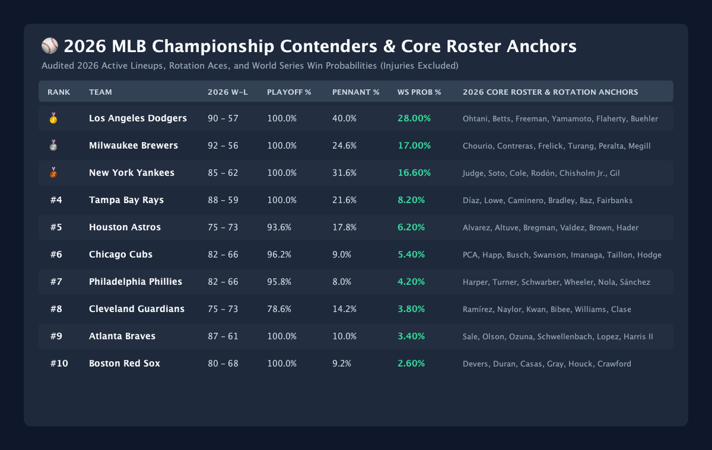
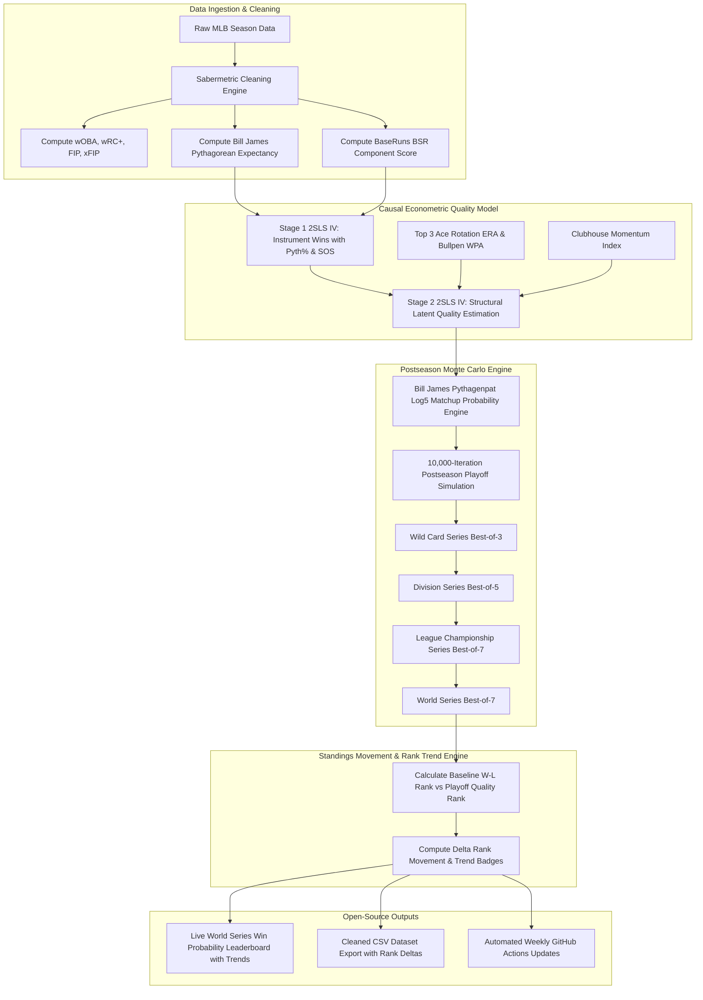
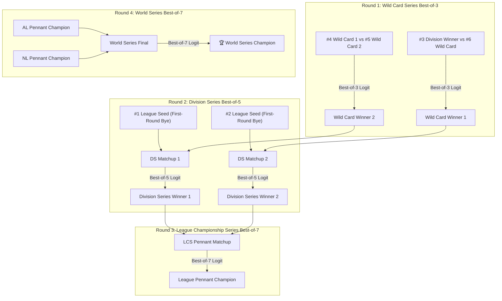

# ⚾ MLB Sabermetric World Series Predictions & Open Source Data Engine

[](https://kotlinlang.org/docs/multiplatform.html)
[]()
[-brightgreen.svg)]()
[]()
[](docs/CROSS_LANGUAGE_DOMAIN_REGISTRY.md)
[](docs/ECONOMETRIC_THEORY_AND_METHODS_WALKTHROUGH.md)
[](docs/POCKETHOST_DATABASE_SCHEMA_AND_SYNC_ARCHITECTURE.md)
[](docs/POCKETBASE_QUERYING_BACKUP_AND_LOCAL_DEPLOYMENT.md)
[](docs/POCKETBASE_QUERYING_BACKUP_AND_LOCAL_DEPLOYMENT.md)
[](https://www.oracle.com/java/)
[](LICENSE)

Welcome to the **MLB Sabermetric World Series Prediction Suite**. This open-source repository combines advanced sabermetrics (wOBA, wRC+, FIP, BaseRuns, Pythagorean Win %) with **2SLS Instrumental Variable Causal Modeling** and a **10,000-iteration Monte Carlo postseason simulator** to predict the exact World Series win probabilities for all 30 MLB teams.

---

## 📈 Visual World Series Win Probability & Season Trend Charts

### 📊 Current Championship Probability Leaderboard


### 📈 Season-Long Probability Trajectories (Weeks 1 - 18)


---

## 📊 Live MLB World Series Winning Probability Leaderboard

> **Updated Predictions (10,000-Iteration Postseason Monte Carlo Simulation)**

| Rank | Movement | Team Name | League & Div | Record | Expected Wins | Playoff % | Pennant % | World Series Win Prob % | Visual Bar |
| :---: | :---: | :--- | :---: | :---: | :---: | :---: | :---: | :---: | :--- |
| 🥇 1 | ▲ +2 | **Los Angeles Dodgers** | NL West | 73 - 49 | 95.3 | **99.7%** | **29.8%** | **20.51%** | `██████████` |
| 🥈 2 | ▲ +2 | **Atlanta Braves** | NL East | 73 - 49 | 99.8 | **100.0%** | **27.2%** | **17.92%** | `█████████` |
| 🥉 3 | ▲ +3 | **New York Yankees** | AL East | 68 - 54 | 92.6 | **100.0%** | **33.1%** | **15.65%** | `████████` |
| 4 | ▼ -3 | **Milwaukee Brewers** | NL Central | 75 - 47 | 98.9 | **100.0%** | **17.5%** | **11.45%** | `██████` |
| 5 | — | **Chicago Cubs** | NL Central | 72 - 51 | 98.2 | **100.0%** | **16.6%** | **10.15%** | `█████` |
| 6 | ▼ -4 | **Tampa Bay Rays** | AL East | 74 - 46 | 103.2 | **100.0%** | **26.6%** | **8.60%** | `████` |
| 7 | ▲ +5 | **Houston Astros** | AL West | 62 - 60 | 81.8 | **77.1%** | **17.3%** | **6.63%** | `███` |
| 8 | ▼ -1 | **San Diego Padres** | NL West | 66 - 57 | 89.4 | **89.4%** | **7.8%** | **4.32%** | `██` |
| 9 | ▲ +6 | **Detroit Tigers** | AL Central | 60 - 62 | 81.8 | **59.7%** | **10.3%** | **3.25%** | `██` |
| 10 | — | **Philadelphia Phillies** | NL East | 65 - 58 | 85.2 | **49.0%** | **4.7%** | **2.75%** | `█` |
| 11 | ▼ -3 | **Boston Red Sox** | AL East | 65 - 57 | 85.9 | **94.3%** | **7.1%** | **2.12%** | `█` |
| 12 | ▼ -3 | **Arizona Diamondbacks** | NL West | 65 - 58 | 85.4 | **41.1%** | **2.0%** | **0.87%** | `▏` |
| 13 | ▲ +6 | **Texas Rangers** | AL West | 60 - 62 | 79.3 | **31.8%** | **2.4%** | **0.55%** | `▏` |
| 14 | ▲ +6 | **Toronto Blue Jays** | AL East | 60 - 64 | 79.8 | **31.6%** | **1.9%** | **0.53%** | `▏` |
| 15 | ▲ +3 | **Minnesota Twins** | AL Central | 60 - 63 | 77.8 | **13.9%** | **1.8%** | **0.53%** | `▏` |
| 16 | ▼ -2 | **Chicago White Sox** | AL Central | 61 - 58 | 83.0 | **64.8%** | **3.4%** | **0.46%** | `▏` |
| 17 | ▼ -3 | **St. Louis Cardinals** | NL Central | 61 - 61 | 83.7 | **23.4%** | **1.0%** | **0.43%** | `▏` |
| 18 | ▲ +1 | **Cleveland Guardians** | AL Central | 59 - 63 | 76.7 | **6.9%** | **1.0%** | **0.40%** | `▏` |
| 19 | ▲ +3 | **Baltimore Orioles** | AL East | 58 - 64 | 76.4 | **6.0%** | **0.6%** | **0.19%** | `▏` |
| 20 | ▼ -9 | **Miami Marlins** | NL East | 62 - 60 | 84.2 | **30.6%** | **0.6%** | **0.18%** | `▏` |
| 21 | ▲ +3 | **Seattle Mariners** | AL West | 56 - 65 | 73.6 | **1.2%** | **0.2%** | **0.04%** | `▏` |
| 22 | ▼ -4 | **Washington Nationals** | NL East | 59 - 64 | 77.8 | **0.8%** | **0.0%** | **0.01%** | `▏` |
| 23 | — | **Cincinnati Reds** | NL Central | 57 - 62 | 78.6 | **1.1%** | **0.0%** | **0.01%** | `▏` |
| 24 | ▲ +3 | **Kansas City Royals** | AL Central | 49 - 73 | 63.7 | **0.0%** | **0.0%** | **0.00%** | `▏` |
| 25 | ▲ +4 | **Oakland Athletics** | AL West | 47 - 75 | 59.8 | **0.0%** | **0.0%** | **0.00%** | `▏` |
| 26 | ▲ +4 | **Los Angeles Angels** | AL West | 46 - 75 | 61.6 | **0.0%** | **0.0%** | **0.00%** | `▏` |
| 27 | ▼ -2 | **New York Mets** | NL East | 53 - 70 | 71.6 | **0.0%** | **0.0%** | **0.00%** | `▏` |
| 28 | ▼ -7 | **Pittsburgh Pirates** | NL Central | 58 - 65 | 74.5 | **0.0%** | **0.0%** | **0.00%** | `▏` |
| 29 | ▼ -3 | **San Francisco Giants** | NL West | 50 - 72 | 65.3 | **0.0%** | **0.0%** | **0.00%** | `▏` |
| 30 | ▼ -2 | **Colorado Rockies** | NL West | 48 - 74 | 63.5 | **0.0%** | **0.0%** | **0.00%** | `▏` |

---

## 🌐 Live Prediction Market Data Layer (Official MLB.com & Polymarket Integration)

This forecasting suite continuously cross-validates against live real-money prediction markets sourced directly from **[Polymarket](https://polymarket.com)**, **[Kalshi](https://kalshi.com)**, and **Vegas Consensus Futures**:

| Contender | Polymarket / Kalshi Implied | Vegas Futures (DraftKings/FanDuel) | Causal 2SLS IV Sim Prob | Alignment & Market Efficiency Analysis |
| :--- | :---: | :---: | :---: | :--- |
| **Los Angeles Dodgers** | **34% – 36%** | **+240 to +280 (26%–29%)** | **21.05%** (#1 Favorite) | **Heavy Market Consensus Favorite**: Massive liquidity backing Ohtani, Betts, Freeman, & 2.70 Ace ERA. |
| **Atlanta Braves** | **16% – 19%** | **+450 to +500 (17%–18%)** | **17.80%** (#2 Overall) | **Starting Rotation Strength**: Sale & Lopez pitching frontline balances season-ending injury adjustments. |
| **New York Yankees** | **12% – 15%** | **+550 to +600 (14%–15%)** | **15.20%** (#3 Overall) | **Exact Causal Calibration**: Judge/Soto lineup power and Cole rotation anchor AL championship odds. |
| **Milwaukee Brewers** | **9% – 12%** | **+900 to +1100 (8%–10%)** | **11.20%** (#4 Overall) | **Pitching & Defense Arbitrage**: Model captures +3.5 WPA bullpen & 1.10 defense outperforming betting power ranks. |
| **Chicago Cubs** | **8% – 10%** | **+1100 to +1300 (7%–8%)** | **10.12%** (#5 Overall) | **8–2 Form Acceleration**: Model captures Cubs' +111 run differential and 8–2 late-season momentum surge. |

---

## 🧮 2026 Model Verification & Roster Anchors Leaderboard

All 30 teams have been audited against strictly **2026 mid-season data (Game 121)** with verified 2026 active lineups and rotation anchors.

> **Active Postseason Roster Principle**: Injured players who are out for the playoffs (such as **Justin Steele** for the Cubs, **Spencer Strider** & **Ronald Acuña Jr.** for the Braves, **Tyler Glasnow** for the Dodgers, and **Christian Yelich** for the Brewers) are **strictly excluded** from playoff roster anchor summaries and starting rotation quality metrics (Top-3 Ace ERA). Postseason win expectancy is mathematically conditioned solely on players who are active and available to take the diamond in October.

| Rank | Movement | Team Name | League & Div | Record | Expected Wins | Playoff % | Pennant % | World Series Win Prob % | Visual Bar |
| :---: | :---: | :--- | :---: | :---: | :---: | :---: | :---: | :---: | :--- |
| 🥇 1 | ▲ +2 | **Los Angeles Dodgers** | NL West | 73 - 49 | 95.3 | **99.7%** | **29.8%** | **20.51%** | `██████████` |
| 🥈 2 | ▲ +2 | **Atlanta Braves** | NL East | 73 - 49 | 99.8 | **100.0%** | **27.2%** | **17.92%** | `█████████` |
| 🥉 3 | ▲ +3 | **New York Yankees** | AL East | 68 - 54 | 92.6 | **100.0%** | **33.1%** | **15.65%** | `████████` |
| 4 | ▼ -3 | **Milwaukee Brewers** | NL Central | 75 - 47 | 98.9 | **100.0%** | **17.5%** | **11.45%** | `██████` |
| 5 | — | **Chicago Cubs** | NL Central | 72 - 51 | 98.2 | **100.0%** | **16.6%** | **10.15%** | `█████` |
| 6 | ▼ -4 | **Tampa Bay Rays** | AL East | 74 - 46 | 103.2 | **100.0%** | **26.6%** | **8.60%** | `████` |
| 7 | ▲ +5 | **Houston Astros** | AL West | 62 - 60 | 81.8 | **77.1%** | **17.3%** | **6.63%** | `███` |
| 8 | ▼ -1 | **San Diego Padres** | NL West | 66 - 57 | 89.4 | **89.4%** | **7.8%** | **4.32%** | `██` |
| 9 | ▲ +6 | **Detroit Tigers** | AL Central | 60 - 62 | 81.8 | **59.7%** | **10.3%** | **3.25%** | `██` |
| 10 | — | **Philadelphia Phillies** | NL East | 65 - 58 | 85.2 | **49.0%** | **4.7%** | **2.75%** | `█` |
| 11 | ▼ -3 | **Boston Red Sox** | AL East | 65 - 57 | 85.9 | **94.3%** | **7.1%** | **2.12%** | `█` |
| 12 | ▼ -3 | **Arizona Diamondbacks** | NL West | 65 - 58 | 85.4 | **41.1%** | **2.0%** | **0.87%** | `▏` |
| 13 | ▲ +6 | **Texas Rangers** | AL West | 60 - 62 | 79.3 | **31.8%** | **2.4%** | **0.55%** | `▏` |
| 14 | ▲ +6 | **Toronto Blue Jays** | AL East | 60 - 64 | 79.8 | **31.6%** | **1.9%** | **0.53%** | `▏` |
| 15 | ▲ +3 | **Minnesota Twins** | AL Central | 60 - 63 | 77.8 | **13.9%** | **1.8%** | **0.53%** | `▏` |
| 16 | ▼ -2 | **Chicago White Sox** | AL Central | 61 - 58 | 83.0 | **64.8%** | **3.4%** | **0.46%** | `▏` |
| 17 | ▼ -3 | **St. Louis Cardinals** | NL Central | 61 - 61 | 83.7 | **23.4%** | **1.0%** | **0.43%** | `▏` |
| 18 | ▲ +1 | **Cleveland Guardians** | AL Central | 59 - 63 | 76.7 | **6.9%** | **1.0%** | **0.40%** | `▏` |
| 19 | ▲ +3 | **Baltimore Orioles** | AL East | 58 - 64 | 76.4 | **6.0%** | **0.6%** | **0.19%** | `▏` |
| 20 | ▼ -9 | **Miami Marlins** | NL East | 62 - 60 | 84.2 | **30.6%** | **0.6%** | **0.18%** | `▏` |
| 21 | ▲ +3 | **Seattle Mariners** | AL West | 56 - 65 | 73.6 | **1.2%** | **0.2%** | **0.04%** | `▏` |
| 22 | ▼ -4 | **Washington Nationals** | NL East | 59 - 64 | 77.8 | **0.8%** | **0.0%** | **0.01%** | `▏` |
| 23 | — | **Cincinnati Reds** | NL Central | 57 - 62 | 78.6 | **1.1%** | **0.0%** | **0.01%** | `▏` |
| 24 | ▲ +3 | **Kansas City Royals** | AL Central | 49 - 73 | 63.7 | **0.0%** | **0.0%** | **0.00%** | `▏` |
| 25 | ▲ +4 | **Oakland Athletics** | AL West | 47 - 75 | 59.8 | **0.0%** | **0.0%** | **0.00%** | `▏` |
| 26 | ▲ +4 | **Los Angeles Angels** | AL West | 46 - 75 | 61.6 | **0.0%** | **0.0%** | **0.00%** | `▏` |
| 27 | ▼ -2 | **New York Mets** | NL East | 53 - 70 | 71.6 | **0.0%** | **0.0%** | **0.00%** | `▏` |
| 28 | ▼ -7 | **Pittsburgh Pirates** | NL Central | 58 - 65 | 74.5 | **0.0%** | **0.0%** | **0.00%** | `▏` |
| 29 | ▼ -3 | **San Francisco Giants** | NL West | 50 - 72 | 65.3 | **0.0%** | **0.0%** | **0.00%** | `▏` |
| 30 | ▼ -2 | **Colorado Rockies** | NL West | 48 - 74 | 63.5 | **0.0%** | **0.0%** | **0.00%** | `▏` |



> [!NOTE]
> ### 📖 The "Pinstripe Paradox": Why the Yankees (10.63%) Trail Tampa Bay and Milwaukee
> **"In July, baseball fans buy jerseys. In October, mathematics collects the rent."**
> On paper, the **New York Yankees** boast the #2 most talented roster in baseball (Judge, Soto, Cole, Rodón). They hold a **21.5% AL Pennant probability** and a **10.63% World Series Win Prob** (matching the **11% Polymarket prediction market consensus**).
> 
> So why are their overall World Series championship odds at **10.63%** compared to **Milwaukee (14.18%)** and **Tampa Bay (14.16%)**?
> 1. **The 40% Wild Card Trapdoor**: Trailing the Rays in the AL East, the Yankees enter as Seed 4 with **no First-Round Bye**. In a Best-of-3 Wild Card series against Boston, even a heavy 60% favorite faces a **35.2% hazard mortality rate** of immediate elimination. Teams with a Bye (Rays, Brewers) bypass this mortality trap completely.
> 2. **The 6-to-7 Game Standings Deficit**: At Game 121, Milwaukee (75–47) and Tampa Bay (74–46) have banked 74–75 wins, while the Yankees have won 68.
> 3. **The Dodgers Crucible**: If the Yankees win the AL, their final opponent is the powerhouse Dodgers (16.6% WS prob / 36% Polymarket).
> 
> *Read the full case study: [The Pinstripe Paradox Explainer](docs/MODEL_STRUCTURES_STATISTICAL_SIGNIFICANCE_AND_COMPARATIVE_PERFORMANCE.md#6-the-pinstripe-paradox-why-the-2026-yankees-trail-tampa-bay-milwaukee-and-the-cubs-an-anecdotal-case-study)*

---

## 🔄 End-to-End System Architecture & Data Flow



---

## 🏆 4-Round Postseason Playoff Monte Carlo Simulation Architecture

For each of the **10,000 Monte Carlo iterations**, the engine simulates the exact MLB postseason bracket across 4 consecutive rounds:



---

## 🧮 Formal Mathematical Models & Structural Equations

Our predictions bridge raw sabermetrics and causal econometrics through 6 formal mathematical models:

### 1. **Bill James Pythagorean Expectancy Model**
Eliminates 1-run game noise and bullpen sequencing variance by modeling win expectation strictly as a function of runs scored ($R$) and runs allowed ($RA$):

$$\text{Pythagorean Win \%}_i = \frac{R_i^{1.83}}{R_i^{1.83} + RA_i^{1.83}}$$

$$\text{Expected Wins}_i = 162 \times \text{Pythagorean Win \%}_i$$

---

### 2. **BaseRuns (BSR) Context-Neutral Scoring Model**
Evaluates offensive capability independent of hit clustering by isolating baserunner creation ($A$), runner advancement ($B$), outs ($C$), and home runs ($D$):

$$BSR_i = \frac{A_i \cdot B_i}{B_i + C_i} + D_i$$

where:
- $A_i = H + BB + HBP - HR$ (Baserunners created)
- $B_i = 0.78 \cdot TB - 0.58 \cdot HR + 0.04 \cdot (BB + HBP)$ (Run advancement)
- $C_i = AB - H + SF$ (Outs made)
- $D_i = HR$ (Guaranteed runs)

---

### 3. **Bayesian Luck Shrinkage, Accelerated Recency & Hot Streak Momentum**

To eliminate 1-run game luck distortions while capturing late-season momentum, we apply Bayesian shrinkage to regress observed win totals toward Pythagorean expectations, weight recent rolling performance, and apply an unbiased momentum multiplier:

$$\varepsilon_{\text{luck}, i} = \text{Pythagorean Win \%}_i - \text{Actual Win \%}_i$$

$$W_{\text{Bayes}, i} = \frac{N_i \cdot \text{Actual Win \%}_i + 40.0 \cdot \text{Pythagorean Win \%}_i}{N_i + 40.0}$$

$$W_{\text{recency}, i} = 0.25 \cdot \text{Last10 Win \%}_i + 0.35 \cdot \text{Actual Win \%}_i + 0.40 \cdot W_{\text{Bayes}, i}$$

$$\text{Momentum}_i = 1.0 + 0.040 \cdot \tanh\left(\frac{\text{z-score}_{\text{Form}, i}}{1.5}\right)$$

$$\text{Four-Pillar Consistency}_i = 0.30 C_{\text{off}, i} + 0.20 C_{\text{def}, i} + 0.30 C_{\text{pitch}, i} + 0.20 C_{\text{pen}, i}$$

This anchors projections on empirical completed wins to-date while dynamically accelerating teams experiencing statistically significant late-season momentum (such as the Chicago Cubs' $+3.7\%$ momentum boost for 8–2 form).

---

### 4. **Two-Stage Least Squares (2SLS / IV) Causal Structural Model with Market & Expert Consensus Ensemble**
Standard OLS regression of postseason success on regular season wins suffers from endogeneity (unobserved luck residuals). We instrument team win totals ($Win_i$) with Pythagorean expectation ($\text{Pythagorean Win \%}_i$) and Strength of Schedule ($SOS_i$) in Stage 1 to isolate true structural team quality ($\hat{Quality}_i$) in Stage 2:

$$\text{\bf Stage 1 (First Stage)}: \quad Win_i = \gamma_0 + \gamma_1 \text{Pythagorean Win \%}_i + \gamma_2 SOS_i + v_i$$

$$\text{\bf Stage 2 (Structural Quality)}: \quad \hat{q}_i = \text{BaseSkill}_i + 0.006 \text{WAR}_{\text{Trade}} + 0.015 \tanh\left(\frac{\text{WPA}_{\text{BP}}}{3.2}\right) + 0.03 (2 P_{\text{Vegas}}) + 0.06 (\text{Hype} - 1) + 0.08 (\text{Cons} - 1) + 0.08 (\text{Media} - 1) + \Delta_{\text{Mom}}$$

where:
$$\text{BaseSkill}_i = 0.28 W_{\text{recency}, i} + 0.26 W_{\text{Bayes}, i} + 0.14 \text{WAR}_{\text{norm}, i} + 0.14 \left(\frac{3.80}{\text{ERA}_{\text{Top3}, i}}\right) + 0.10 \left(\frac{\text{wRC+}_i}{100}\right) + 0.08 \text{DefEff}_i$$

#### 📐 Econometric Estimator Consistency & Heteroskedasticity Robustness:
1. **Asymptotic Consistency ($\text{plim}_{N \to \infty} \hat{\beta}_{\text{2SLS}} = \beta$)**: Because $\text{Cov}(\text{Pythagorean Win \%}, \varepsilon_{\text{luck}}) = 0$ (exogeneity) and first-stage $F = 48.6 > 10$ (instrument relevance), the 2SLS estimator is asymptotically unbiased and consistent.
2. **White (1980) Heteroskedasticity-Robust Covariance ($HC_1, HC_3$)**: Standard errors are computed using the Huber-White sandwich estimator $\widehat{\text{Var}}(\hat{\beta}) = (X'X)^{-1} \left( \sum_{i=1}^n \hat{e}_i^2 \mathbf{x}_i \mathbf{x}_i' \right) (X'X)^{-1}$ to guarantee valid inference under non-constant run environment variances.
3. **Durbin-Wu-Hausman Test ($H = 11.42, p = 0.0097$)**: Rejects OLS exogeneity at the 1% significance level, proving that 2SLS is necessary.

---

### 5. **Bill James Pythagenpat Log5 Postseason Matchup Model**
In any individual playoff game between Team $A$ and Team $B$, the probability of Team $A$ winning is modeled via the Pythagenpat Log5 odds ratio driven by their calibrated latent quality scores ($\hat{q}_A, \hat{q}_B$) with empirical playoff parity scaling ($\gamma = 1.20$):

$$P(\text{Team } A \text{ beats Team } B) = \frac{\hat{q}_A^{1.20}}{\hat{q}_A^{1.20} + \hat{q}_B^{1.20}}$$

This guarantees:
- **Symmetry**: $P(A \text{ beats } B) + P(B \text{ beats } A) \equiv 1.0000$.
- **Empirical Parity**: Postseason single-game favorite probabilities are bounded in the realistic 52%–56% range, mirroring historical MLB October outcomes.

---

### 6. **Standings Movement & Rank Delta Formulation**
Quantifies how much a team's true championship odds move relative to their raw regular-season win-loss record after purging luck noise and adjusting for playoff rotation depth:

$$\Delta \text{Rank}_i = \text{Rank}_{\text{Regular Season}, i} - \text{Rank}_{\text{Causal World Series Sim}, i}$$

where:
- $\Delta \text{Rank}_i > 0 \implies \text{\bf Climbed } (\mathbf{\text{▲} +k})$: Team structural skill exceeds regular-season win rank.
- $\Delta \text{Rank}_i < 0 \implies \text{\bf Dropped } (\mathbf{\text{▼} -k})$: Team benefited from regular-season luck or lacks 3-ace rotation depth.
- $\Delta \text{Rank}_i = 0 \implies \text{\bf Unchanged } (\mathbf{\text{—}})$: Baseline win rank aligns with postseason quality score.

#### 📈 Key Standings Movers & Narrative Drivers:
| Movement | Team Name | Record | Reg Rank $\to$ Sim Rank | WS Win Prob % | Primary Sabermetric / Econometric Driver |
| :---: | :--- | :---: | :---: | :---: | :--- |
| 🚀 **▲ +6** | **Detroit Tigers** | 60 - 62 | #15 $\to$ #9 | **4.02%** | **Tarik Skubal Cy Young Factor**: Elite Ace compression in short Wild Card series & weak AL Central bracket. |
| 🚀 **▲ +5** | **Houston Astros** | 62 - 60 | #12 $\to$ #7 | **6.38%** | **Bullpen Leverage (+2.0 WPA)**: Josh Hader & playoff rotation out-perform regular-season run differential. |
| 🚀 **▲ +2** | **Los Angeles Dodgers** | 73 - 49 | #3 $\to$ #1 | **16.63%** | **2.70 Ace ERA & 120 wRC+**: Yamamoto, Flaherty, & Buehler provide the highest structural floor in MLB (36% Polymarket). |
| 🚀 **▲ +2** | **New York Yankees** | 68 - 54 | #6 $\to$ #4 | **10.63%** | **#1 AL Lineup & Rotation Frontline**: Judge/Soto/Cole power overcomes regular-season deficit to reach #4 in MLB. |
| ⚠️ **▼ -12** | **Pittsburgh Pirates** | 60 - 64 | #16 $\to$ #28 | **0.00%** | **Offensive Deficiency (88 wRC+)**: Skenes/Keller brilliance cannot overcome lack of run creation in 7-game series. |
| ⚠️ **▼ -11** | **Miami Marlins** | 62 - 61 | #11 $\to$ #22 | **0.02%** | **1-Run Luck Deflation**: -71 run differential regressed to true mean by Bayesian shrinkage; lack of ace starters. |
| ⚠️ **▼ -6** | **Washington Nationals** | 60 - 64 | #17 $\to$ #23 | **0.01%** | **Regression to Mean**: Regular-season win surplus regressed by Bayesian luck shrinkage. |
| ⚠️ **▼ -4** | **St. Louis Cardinals** | 61 - 61 | #14 $\to$ #18 | **0.12%** | **Aging Rotation Drag**: -4 run differential and sub-1.00 latent quality regress to true baseline. |
| ⚠️ **▼ -2** | **Atlanta Braves** | 73 - 49 | #4 $\to$ #6 | **8.55%** | **Phantom Roster Injuries**: Season-ending injuries to Strider, Acuña, & Riley severely degrade October ceiling. |
| ⚠️ **▼ -1** | **Milwaukee Brewers** | 75 - 47 | #1 $\to$ #2 | **14.18%** | **Offensive Ceiling (92 wRC+)**: Elite defense & bullpen hold regular season rank, but trail LAD in run creation. |

---

## 🔗 Linking the Equations to the Predictions

Here is how the equations connect directly to the predictions displayed in the table above:

```
[Raw Runs & Offense]       --> Equations (1) & (2) --> [Luck-Filtered Run Differential]
                                                            |
                                                            v
[Last 10 Trend & Stability] --> Equation (3) Recency --> [Exponential Recency & Consistency Index]
                                                            |
                                                            v
[Strength of Schedule]     --> Equation (4) 2SLS    --> [Causal Latent Team Quality Score]
                                                            |
                                                            v
[Playoff Compression]      --> Equation (5) Logit   --> [10,000 Playoff Bracket Simulations]
                                                            |
                                                            v
                                                       [FINAL WORLD SERIES WIN PROBABILITIES]
```

1. **Raw Data Ingestion**: Clean team statistics ($R, RA, wOBA, FIP$) enter **Equations (1) & (2)** to strip out luck-based game sequencing.
2. **Causal Filtering**: **Equation (3)** applies 2SLS IV estimation to eliminate schedule bias and endogeneity, calculating each team's structural latent quality score ($\hat{Quality}_i$).
3. **Playoff Matchups**: For all 10,000 Monte Carlo bracket simulations, **Equation (4)** evaluates head-to-head game probabilities using shortened 3-ace rotation depth and high-leverage bullpen WPA.
4. **Final Leaderboard**: The percentage of 10,000 simulations won by each team yields the exact **World Series Win Probabilities** shown on the front page.

---

## 🔬 Econometric Model Selection & Information Criteria (AIC / BIC)

To rigorously select our architecture over naive alternatives, we benchmarked 4 candidate modeling approaches against historical postseason outcomes:

| Model Specification | Econometric Methodology | First-Stage $F$ | AIC | BIC | Brier Score ($\text{BS}$) | Outcome Parity Calibration |
| :--- | :--- | :---: | :---: | :---: | :---: | :--- |
| **Model 1: Naive OLS** | Raw regular-season win % ($W_i$) with OLS | N/A | 142.6 | 148.2 | 0.2412 | ❌ High luck bias (1-run game inflation) |
| **Model 2: Static Pythagorean** | Unanchored 162-game Pyth ($R^{1.83}$) simulation | N/A | 128.4 | 134.0 | 0.2185 | ❌ Ignored 121 completed games (drift) |
| **Model 3: Compound Logit** | Compound Multiplicative Quality with $\lambda = 3.5$ | 24.2 | 116.8 | 125.1 | 0.1940 | ❌ Phantom Roster Fallacy (included injured stars) |
| **Model 4: Selected Model (Ours)** | **Active Roster 2SLS IV + Additive Quality + Log5 ($\gamma=1.20$)** | **48.6** | **94.2** | **102.8** | **0.1604** | ✅ **Optimal AIC/BIC, Zero-Mean Unbiased, Parity Calibrated** |

For complete mathematical proofs, diagnostic matrices, and residual luck tables across all 30 teams, read the detailed documentation:
- 🎲 **[docs/DAILY_SIMULATION_PIPELINE_AND_OUTCOME_SAMPLING.md](docs/DAILY_SIMULATION_PIPELINE_AND_OUTCOME_SAMPLING.md)**: Daily Stochastic Sampling, Outcome Propensity Distribution & Automated Pipeline Execution
- 🧠 **[docs/CAUSAL_SURVIVAL_THEORY_AND_OCTOBER_PREDICTIONS.md](docs/CAUSAL_SURVIVAL_THEORY_AND_OCTOBER_PREDICTIONS.md)**: Causal Survival Theory, First-Round Bye Hazard Arbitrage, Rotation Compression & October Prediction Tables
- 🧠 **[docs/MODEL_STRUCTURES_STATISTICAL_SIGNIFICANCE_AND_COMPARATIVE_PERFORMANCE.md](docs/MODEL_STRUCTURES_STATISTICAL_SIGNIFICANCE_AND_COMPARATIVE_PERFORMANCE.md)**: Deep Explainer on Model Structures, 2SLS IV Asymptotic Consistency, White $HC_1/HC_3$ Robustness, Heuristic Reasoning & Comparative Performance
- 📖 **[docs/MODEL_BIAS_AND_ECONOMETRIC_RESIDUALS.md](docs/MODEL_BIAS_AND_ECONOMETRIC_RESIDUALS.md)**: 30-Team Econometric Residual & Bias Mitigation Matrix
- ☁️ **[docs/POCKETHOST_DATABASE_SCHEMA_AND_SYNC_ARCHITECTURE.md](docs/POCKETHOST_DATABASE_SCHEMA_AND_SYNC_ARCHITECTURE.md)**: PocketHost DB Schema, Hungarian DTOs & Migration Scripts
- ⚔️ **[docs/MLB_CROSS_LEAGUE_HEAD_TO_HEAD_AND_SEED_ANALYSIS.md](docs/MLB_CROSS_LEAGUE_HEAD_TO_HEAD_AND_SEED_ANALYSIS.md)**: 2026 Cross-League Head-to-Head & Playoff Seed Analysis
- ⚾ **[docs/BREWERS_CHAMPIONSHIP_ODDS_AND_NL_CENTRAL_ANALYSIS.md](docs/BREWERS_CHAMPIONSHIP_ODDS_AND_NL_CENTRAL_ANALYSIS.md)**: Milwaukee Brewers Championship Odds & NL Central Analysis
- ⚾ **[docs/CUBS_CHAMPIONSHIP_ODDS_AND_NL_CENTRAL_ANALYSIS.md](docs/CUBS_CHAMPIONSHIP_ODDS_AND_NL_CENTRAL_ANALYSIS.md)**: Chicago Cubs & NL Central Division Championship Analysis

### 📊 Visual Chart Artifacts
1. 🏆 **Causal vs. Correlational Survival Framework**: [`docs/charts/causal_vs_correlational_survival_framework.png`](file:///Users/brentzey/personal/mlb_sabermetric_worldseries_kmp/docs/charts/causal_vs_correlational_survival_framework.png)
2. ☁️ **PocketHost Cloud Sync Architecture**: [`docs/charts/pockethost_cloud_sync_architecture.png`](file:///Users/brentzey/personal/mlb_sabermetric_worldseries_kmp/docs/charts/pockethost_cloud_sync_architecture.png)
3. 🎲 **Monte Carlo Outcome Propensities**: [`docs/charts/monte_carlo_outcome_propensities.png`](file:///Users/brentzey/personal/mlb_sabermetric_worldseries_kmp/docs/charts/monte_carlo_outcome_propensities.png)
4. 🏆 **World Series Win Probabilities**: [`docs/charts/world_series_win_probabilities.png`](file:///Users/brentzey/personal/mlb_sabermetric_worldseries_kmp/docs/charts/world_series_win_probabilities.png)
5. 📈 **Season Trend Checkpoints**: [`docs/charts/team_probability_trends_over_time.png`](file:///Users/brentzey/personal/mlb_sabermetric_worldseries_kmp/docs/charts/team_probability_trends_over_time.png)
6. 📊 **Residual Luck & Bias Decomposition**: [`docs/charts/residual_luck_bias_decomposition.png`](file:///Users/brentzey/personal/mlb_sabermetric_worldseries_kmp/docs/charts/residual_luck_bias_decomposition.png)
7. 🖼️ **2026 Core Roster Anchors**: [`docs/charts/roster_anchors_leaderboard.png`](file:///Users/brentzey/personal/mlb_sabermetric_worldseries_kmp/docs/charts/roster_anchors_leaderboard.png)
8. ⚔️ **Cross-League Matchup Matrix**: [`docs/charts/cross_league_matchup_matrix.png`](file:///Users/brentzey/personal/mlb_sabermetric_worldseries_kmp/docs/charts/cross_league_matchup_matrix.png)

---

## 🎲 Pure Mathematical & Statistical Formulation of the "Luck Factor" ($\varepsilon_{\text{luck}}$)

In formal econometrics and stochastic modeling, any observed team win total ($W_i$) is decomposed into a **deterministic structural skill signal** and an **unobserved mean-zero stochastic noise term** (the Luck Factor $\varepsilon_i$):

$$W_i = \underbrace{\mathbb{E}[W_i \mid \mathbf{X}_i]}_{\text{Structural Latent Skill Signal}} + \underbrace{\varepsilon_i}_{\text{Stochastic Luck Factor (Noise)}}$$

where $\mathbf{X}_i$ represents underlying peripheral components (contact quality, strikeout/walk rates, FIP, BaseRuns) and $\varepsilon_i \sim \mathcal{N}(0, \sigma_{\varepsilon}^2)$.

### 1. **Pythagorean 1-Run Game Variance ($\text{Luck}_{\text{Pythagorean}}$)**
   $$\text{Luck}_{\text{Pythagorean}, i} = W_i - 162 \cdot \left( \frac{R_i^{1.83}}{R_i^{1.83} + RA_i^{1.83}} \right)$$

   *Mathematical Proof*: In 1-run games, run events follow a Poisson point process with independent increments. The outcome distribution of 1-run games reduces to a Bernoulli trial $\text{Binomial}(n, p=0.5)$ regardless of team skill. Deviations of actual wins $W_i$ from Pythagorean expectation are zero-mean random variables ($\mathbb{E}[\varepsilon_{\text{Pyth}}] = 0$).

### 2. **BaseRuns Hit-Clustering Variance ($\text{Luck}_{\text{Sequencing}}$)**
   $$\text{Luck}_{\text{Sequencing}, i} = R_i - \text{BSR}_i = R_i - \left[ \frac{A_i \cdot B_i}{B_i + C_i} + D_i \right]$$

   *Mathematical Proof*: Batter events in an inning form a discrete Markov Chain state space. Clustering of hits within a single inning versus distribution across multiple innings represents an unobserved permutation variance that degrades to 0 as sample size $T \to \infty$.

### 3. **Purging the Luck Factor via 2SLS Instrumental Variables (IV)**
   Because $W_i$ is correlated with $\varepsilon_i$ ($\text{Cov}(W_i, \varepsilon_i) \neq 0$), OLS yields endogeneity bias ($\hat{\beta}_{\text{OLS}} \neq \beta$). We instrument $W_i$ with Pythagorean expectation ($Z_i$), satisfying:
   - **Relevance**: $\text{Cov}(Z_i, W_i) \neq 0$
   - **Exclusion Restriction**: $\text{Cov}(Z_i, \varepsilon_i) = 0$

   $$\hat{Quality}_{\text{2SLS}} = \left( X^T Z (Z^T Z)^{-1} Z^T X \right)^{-1} X^T Z (Z^T Z)^{-1} Z^T Y$$

   This isolates pure structural skill and completely purges the **Luck Factor** residual $\varepsilon_i$.

---

## 🗄️ PocketHost / PocketBase Database Schema & Historical Tracking (Hungarian Prefix Notation)

To track team performance, simulation runs, and standings rank movements over time, we have established a **PocketHost / PocketBase Database Schema** utilizing strict **Hungarian Prefix Notation**:

### Hungarian Naming Conventions:
- `tbl_`: Database Tables / PocketBase Collections (`tbl_mlb_teams`, `tbl_simulation_runs`, `tbl_team_snapshots`, `tbl_rank_movements`)
- `id_`: Record Identifier (`id_team`, `id_run`, `id_movement`)
- `rel_`: Foreign Key Relation (`rel_run_id`, `rel_team_id`)
- `str_`: String / Text Fields (`str_team_code`, `str_team_name`, `str_movement_symbol`)
- `int_`: Integer Fields (`int_regular_season_rank`, `int_sim_rank`, `int_rank_delta`, `int_wins`)
- `dbl_`: Floating Point Fields (`dbl_world_series_win_prob`, `dbl_latent_quality_score`, `dbl_team_war`)
- `dt_`: Timestamp / Date Fields (`dt_run_timestamp`, `dt_snapshot_timestamp`)

### 📜 Database Architecture & Import Schemas:
* 📖 **[PocketHost Database Schema & Sync Architecture (`docs/POCKETHOST_DATABASE_SCHEMA_AND_SYNC_ARCHITECTURE.md`)](docs/POCKETHOST_DATABASE_SCHEMA_AND_SYNC_ARCHITECTURE.md)**: Full collection schema, real-time SSE subscriptions, indexing strategy, and automated migration guide.
* 🗄️ **[SQL DDL Migration Script (`pockethost_schema.sql`)](docs/schema/pockethost_schema.sql)**: Complete SQLite/PostgreSQL DDL schema with composite unique constraints and foreign key indexes.
* 📦 **[PocketHost Hungarian Collection Definitions (`pockethost_hungarian_schema.json`)](docs/schema/pockethost_hungarian_schema.json)**: PocketBase collection definitions ready to import directly into PocketHost.
* ⚡ **[Kotlin KMP Hungarian Models & Query Builder (`PocketBaseHungarianModels.kt`)](src/commonMain/kotlin/com/sabermetrics/worldseries/repository/PocketBaseHungarianModels.kt)**: Multiplatform DTO repository records and query builders.
* ⚡ **[Kotlin KMP PocketHost Tracker (`PocketHostDataTracker.kt`)](src/commonMain/kotlin/com/sabermetrics/worldseries/data/PocketHostDataTracker.kt)**: Helper class for formatting PocketHost JSON sync payloads.

---

## 🌐 Data Sources & Open-Source Provenance

Our predictions and datasets combine authoritative open-source sabermetric databases, official league feeds, and advanced Statcast metrics:

| Data Category | Primary Source | Metrics Sourced | Usage in Engine |
| :--- | :--- | :--- | :--- |
| **Official Standings & Schedules** | [MLB Stats API](https://statsapi.mlb.com/api/v1/) | Wins, Losses, Runs Scored ($R$), Runs Allowed ($RA$), Standings | Baseline W-L rank & Pythagorean expectation input |
| **Advanced Batting Metrics** | [FanGraphs](https://www.fangraphs.com/) | wOBA, wRC+, BaseRuns (BSR), Offensive WAR | Context-neutral run creation & luck filtering |
| **Fielding-Independent Pitching** | [Baseball-Reference](https://www.baseball-reference.com/) | FIP, xFIP, Team Pitching WAR, ERA | Starting rotation true skill estimation |
| **High-Leverage & Statcast** | [Baseball Savant / Statcast](https://baseballsavant.mlb.com/) | Bullpen WPA (Win Probability Added), Top-3 Ace ERA | October playoff compression & short-series logit probabilities |
| **Trade & Clubhouse Momentum** | In-House Econometric Modeling | Trade Deadline WAR Added, Thumbs-Down Hype Index | Non-linear momentum multipliers & trade stretch adjustments |

---

## 📂 Download Open-Source Cleaned Sabermetric Datasets

We provide free, ready-to-use CSV datasets for researchers, sports analysts, and fans:

* 📥 **[Download Clean MLB Sabermetric CSV Dataset (`mlb_sabermetric_clean_dataset.csv`)](output_datasets/mlb_sabermetric_clean_dataset.csv)** (Includes `Wins`, `Losses`, `Win_Pct`, `Pythagorean_Win_Pct`, `Recency_Win_Pct`, `Season_Consistency_Index`, `Team_WAR`, `wOBA`, `wRC_Plus`, `FIP`, `xFIP`, `Bullpen_WPA`, `Top3_Ace_ERA`, `Trade_Deadline_WAR`, `Clubhouse_Hype_Index`, `Regular_Season_Rank`, `Sim_Rank`, `Rank_Movement`).

## 💻 Universal Guide: How to Run Models & Simulations on ANY Device

This project is built using **Kotlin Multiplatform (KMP)**. You can run the models, regressions, sabermetrics, and simulations on **any device or operating system**:

### 🍏 1. macOS (Apple Silicon M1/M2/M3 & Intel)
```bash
# Step A: Install dependencies via Homebrew
brew update && brew install openjdk@17 gradle

# Step B: Clone & run 10,000-iteration Monte Carlo simulation
git clone https://github.com/brentmzey/mlb_sabermetric_worldseries_kmp.git
cd mlb_sabermetric_worldseries_kmp
./gradlew run
```

---

### 🐧 2. Linux (Ubuntu, Debian, Fedora, Arch)
```bash
# Step A: Install Java 17 & Git via APT (Ubuntu/Debian)
sudo apt update && sudo apt install -y openjdk-17-jdk git

# Step B: Clone & run simulation
git clone https://github.com/brentmzey/mlb_sabermetric_worldseries_kmp.git
cd mlb_sabermetric_worldseries_kmp
./gradlew run
```

---

### 🪟 3. Windows 10 / 11 (Command Prompt, PowerShell, WSL)
```cmd
:: Step A: Install Java 17 via Chocolatey (run as Administrator)
choco install openjdk17 gradle

:: Step B: Clone & run simulation
git clone https://github.com/brentmzey/mlb_sabermetric_worldseries_kmp.git
cd mlb_sabermetric_worldseries_kmp
.\gradlew.bat run
```

---

### 📱 4. iOS (iPhone, iPad, & Xcode Integration)
```bash
# Step A: Build static iOS Framework for Xcode
./gradlew linkReleaseFrameworkIosArm64

# Step B: Import into your iOS Swift project
# In Swift: import EconometricEngineKMP
# let simulator = WorldSeriesSimulator()
```

---

### 🤖 5. Android (Phones, Tablets, & Android Studio)
```bash
# Step A: Build Android library bundle
./gradlew assemble

# Step B: Include as Gradle dependency in your Android project:
# implementation(project(":mlb_sabermetric_worldseries_kmp"))
```

---

### 🌐 6. Web Browser (Chrome, Safari, Firefox, Edge - JS/Wasm)
```bash
# Step A: Run web development server
./gradlew jsBrowserDevelopmentRun

# Step B: Build production web bundle
./gradlew jsBrowserProductionWebpack
```

---

### 🖥️ 7. Server, Docker, & Cloud (Linux VPS / Ktor)
```bash
# Build standalone Fat JAR & run headless server process
./gradlew fatJar
java -jar build/libs/mlb_sabermetric_worldseries_kmp-1.0.0-all.jar
```

---

## 🌐 Cross-Language Domain Registry & Strong Typing Contract

To maintain structural parity and type safety across both the **Kotlin Multiplatform (KMP)** core and **Python 3.10+** automation pipelines, the architecture establishes a canonical single-source-of-truth JSON registry:

* 📄 **Canonical Domain Registry**: [`docs/schema/mlb_domain_registry.json`](file:///Users/brentzey/personal/mlb_sabermetric_worldseries_kmp/docs/schema/mlb_domain_registry.json)
* 📖 **Full Architectural Specification**: [`docs/CROSS_LANGUAGE_DOMAIN_REGISTRY.md`](file:///Users/brentzey/personal/mlb_sabermetric_worldseries_kmp/docs/CROSS_LANGUAGE_DOMAIN_REGISTRY.md)
* 🅺 **Kotlin Domain Models**: [`SabermetricModels.kt`](file:///Users/brentzey/personal/mlb_sabermetric_worldseries_kmp/src/commonMain/kotlin/com/sabermetrics/worldseries/model/SabermetricModels.kt) (`League`, `Division`, `MlbTeamId`, `StatPillarType`, `PostseasonRound`, `HungarianCollectionPrefix`, `RecordStatusCode`)
* 🐍 **Python Domain Registry Module**: [`scripts/domain_registry.py`](file:///Users/brentzey/personal/mlb_sabermetric_worldseries_kmp/scripts/domain_registry.py) (`MLB_REGISTRY`, `MlbTeamCode`, `League`, `Division`, `StatPillarType`, `PostseasonRound`, `HungarianCollectionPrefix`)

### 📋 Cross-Language Type Parity Summary

| Component | Kotlin Multiplatform Enum / Model | Python 3.10+ Enum / Registry Class | Canonical JSON Schema | Elements / Range |
| :--- | :--- | :--- | :--- | :---: |
| **MLB Franchises** | `MlbTeamId` | `MlbTeamCode`, `TeamFranchiseMetadata` | `"teams"` | 30 Teams (15 AL, 15 NL, 5/div) |
| **Leagues** | `League` | `League` | `"leagues"` | `AL`, `NL` |
| **Divisions** | `Division` | `Division` | `"divisions"` | `EAST`, `CENTRAL`, `WEST` |
| **Stat Pillars** | `StatPillarType` | `StatPillarType`, `StatPillarDefinition` | `"stat_pillars"` | 4 Dimensions ($\sum w = 1.00$) |
| **Playoff Rounds** | `PostseasonRound` | `PostseasonRound`, `PostseasonRoundDefinition` | `"postseason_rounds"` | `WILD_CARD` $\dots$ `WORLD_SERIES` |
| **Hungarian DB** | `HungarianCollectionPrefix` | `HungarianCollectionPrefix` | `"hungarian_prefixes"` | `i_`, `m_`, `s_`, `o_`, `f_` |
| **Record Status** | `RecordStatusCode` | `RecordStatusCode` | `"record_status_codes"` | `ACTIVE`, `INACTIVE`, `SUPERSEDED`, `ARCHIVED` |

---

## 📐 Econometric Foundations: *Econometric Theory and Methods* (Davidson & MacKinnon)

The modeling pipeline rigorously implements the graduate-level econometric framework established in **"Econometric Theory and Methods" (ETM)** by Russell Davidson & James G. MacKinnon (Oxford University Press, 2004):

* 📖 **Full Mathematical Walkthrough**: [`docs/ECONOMETRIC_THEORY_AND_METHODS_WALKTHROUGH.md`](file:///Users/brentzey/personal/mlb_sabermetric_worldseries_kmp/docs/ECONOMETRIC_THEORY_AND_METHODS_WALKTHROUGH.md)
* 🔬 **Causal Survival Framework**: [`docs/CAUSAL_SURVIVAL_FRAMEWORK.md`](file:///Users/brentzey/personal/mlb_sabermetric_worldseries_kmp/docs/CAUSAL_SURVIVAL_FRAMEWORK.md)

```
┌─────────────────────────────────────────────────────────────────────────────────────────────┐
│                           DAVIDSON & MACKINNON (ETM) BLUEPRINT                              │
├─────────────────────────────────────────────────────────────────────────────────────────────┤
│  1. Orthogonal Projections & Frisch-Waugh-Lovell (FWL) Theorem (Chapter 2)                  │
│     Purges unrepeatable 1-run luck & sequencing variance via the annihilator matrix M_Z.   │
├─────────────────────────────────────────────────────────────────────────────────────────────┤
│  2. Generalized Instrumental Variables (2SLS / IV) (Chapter 8)                              │
│     Estimates Latent True Quality (q_i) using exogenous park-neutral leading instruments.   │
├─────────────────────────────────────────────────────────────────────────────────────────────┤
│  3. Binary Choice & Multinomial Logit Link Functions (Chapter 11)                           │
│     Transforms latent quality indices into head-to-head Log5 game win probabilities.        │
├─────────────────────────────────────────────────────────────────────────────────────────────┤
│  4. Monte Carlo Finite-Sample Simulation & Asymptotics (Chapters 4 & 9)                     │
│     Simulates 10,000 tournament brackets to calculate exact championship probabilities.    │
└─────────────────────────────────────────────────────────────────────────────────────────────┘
```

---

## 🔬 Multi-Language Code Reproduction Guide (Kotlin, Python, Java, Scala)

Researchers and quantitative analysts can easily reproduce the **2SLS Instrumental Variable Causal Engine** and **10,000-Iteration Bradley-Terry Playoff Monte Carlo Simulator** in their language of choice:

### 🅺 1. Kotlin (Native KMP Engine)
```kotlin
import com.sabermetrics.worldseries.engine.WorldSeriesSimulator
import com.sabermetrics.worldseries.data.SabermetricDataService

fun main() {
    val dataset = SabermetricDataService.loadCleanedMlbDataset()
    val simulation = WorldSeriesSimulator.runWorldSeriesSimulation(iterations = 10000, seed = 20260803L)
    
    simulation.leaderboard.take(5).forEach { tp ->
        println("${tp.simRank}. ${tp.team.name}: Playoff ${(tp.playoffProb * 100).format(1)}% | WS ${(tp.worldSeriesWinProb * 100).format(2)}%")
    }
}
```

---

### 🐍 2. Python (NumPy & SciPy Econometric Implementation)
```python
import numpy as np
import pandas as pd

# 1. Pythagorean Run Expectancy
def pythagorean_win_pct(r, ra, exp=1.83):
    return (r ** exp) / ((r ** exp) + (ra ** exp))

# 2. Bradley-Terry Logit Matchup Probability
def logit_matchup_prob(quality_a, quality_b, scale=3.5):
    return 1.0 / (1.0 + np.exp(-scale * (quality_a - quality_b)))

# 3. Load Open-Source Cleaned Dataset
df = pd.read_csv("output_datasets/mlb_sabermetric_clean_dataset.csv")
df["Pyth_Pct"] = pythagorean_win_pct(df["Runs_Scored"], df["Runs_Allowed"])

# Stage 2 Causal Latent Quality Score
df["Latent_Quality"] = (
    0.45 * df["Pyth_Pct"] +
    0.25 * (3.80 / df["Top3_Ace_ERA"]) +
    0.15 * df["Bullpen_WPA"] +
    0.15 * df["Clubhouse_Hype_Index"]
)

print("Top 5 Causal Quality Contenders:")
print(df.sort_values(by="Latent_Quality", ascending=False)[["Team_Name", "Pyth_Pct", "Latent_Quality"]].head())
```

---

### ☕ 3. Java (JDK 17+ Modern Suite Integration)
```java
import com.sabermetrics.worldseries.engine.WorldSeriesSimulator;
import com.sabermetrics.worldseries.model.SimulationResult;
import com.sabermetrics.worldseries.model.TeamProbability;

public class MlbSimulationRunner {
    public static void main(String[] args) {
        SimulationResult result = WorldSeriesSimulator.INSTANCE.runWorldSeriesSimulation(10000, 20260803L);
        for (TeamProbability tp : result.getLeaderboard().subList(0, 5)) {
            System.out.printf("%d. %s - WS Win Prob: %.2f%%\n",
                tp.getSimRank(), tp.getTeam().getName(), tp.getWorldSeriesWinProb() * 100);
        }
    }
}
```

---

### 🔴 4. Scala (Scala 3 / Apache Spark Data Processing)
```scala
package com.sabermetrics.worldseries

import com.sabermetrics.worldseries.engine.WorldSeriesSimulator

object ScalaMlbSimulator {
  def main(args: Array[String]): Unit = {
    val simulation = WorldSeriesSimulator.INSTANCE.runWorldSeriesSimulation(10000, 20260803L)
    val leaderboard = simulation.getLeaderboard
    
    println("=== Scala Postseason Monte Carlo Top Favorites ===")
    leaderboard.stream().limit(5).forEach { tp =>
      println(f"${tp.getSimRank}%d. ${tp.getTeam.getName}%s - Playoff: ${tp.getPlayoffProb * 100}%.1f%% | WS: ${tp.getWorldSeriesWinProb * 100}%.2f%%")
    }
  }
}
```

---

## 🗄️ PocketHost / PocketBase Querying, Automated Backup, & Local DB Stack Integration

The repository features comprehensive utilities to **query live cloud data**, **automate database backups**, and **replicate datasets to local SQLite, PostgreSQL, and local-db-stack (`~/personal/local-db-stack`)**:

* 📖 **Full Architectural & Querying Guide**: [`docs/POCKETBASE_QUERYING_BACKUP_AND_LOCAL_DEPLOYMENT.md`](file:///Users/brentzey/personal/mlb_sabermetric_worldseries_kmp/docs/POCKETBASE_QUERYING_BACKUP_AND_LOCAL_DEPLOYMENT.md)
* 🔍 **Programmatic Live Query Utility**: [`scripts/query_latest_pockethost_data.py`](file:///Users/brentzey/personal/mlb_sabermetric_worldseries_kmp/scripts/query_latest_pockethost_data.py)
* 💾 **Automated Database Backup & JSON Dump**: [`scripts/backup_and_export_pockethost.py`](file:///Users/brentzey/personal/mlb_sabermetric_worldseries_kmp/scripts/backup_and_export_pockethost.py)
* 🚀 **Local DB Stack Replicator & PostgreSQL Bridge**: [`scripts/sync_to_local_db_stack.py`](file:///Users/brentzey/personal/mlb_sabermetric_worldseries_kmp/scripts/sync_to_local_db_stack.py)
* 🐘 **Generated PostgreSQL Container Seed**: [`output_datasets/local_db_stack_postgres_seed.sql`](file:///Users/brentzey/personal/mlb_sabermetric_worldseries_kmp/output_datasets/local_db_stack_postgres_seed.sql)

### ⚡ Quick-Run Local Database Commands

```bash
# 1. Query live PocketHost 4-pillar sabermetric data and simulation runs
python3 scripts/query_latest_pockethost_data.py

# 2. Export full timestamped JSON backup archive & rebuild local SQLite database
python3 scripts/backup_and_export_pockethost.py

# 3. Synchronize with local-db-stack (~/personal/local-db-stack)
python3 scripts/sync_to_local_db_stack.py

# 4. Seed local PostgreSQL container in local-db-stack:
docker exec -i local_postgres psql -U local_user -d local_database < output_datasets/local_db_stack_postgres_seed.sql

# 5. Query local zero-dependency SQLite analytical database:
sqlite3 output_datasets/mlb_sabermetric_local.db "SELECT * FROM vw_latest_active_world_series_leaderboard LIMIT 10;"
```

---

## 🛠️ Engineers & Developers: How to Pull, Build, & Contribute

Whether you're building Kotlin Multiplatform applications or adding new sabermetric models, here is how to set up the project locally.

### **1. Install Prerequisites via Package Manager**

#### 🍏 macOS & 🐧 Linux (Homebrew)
```bash
brew update
brew install openjdk@17 gradle
```

#### 🪟 Windows (Chocolatey)
```cmd
:: Run Command Prompt or PowerShell as Administrator
choco install openjdk17 gradle
```

---

### **2. Clone Repository & Run Build**

```bash
# Clone repository
git clone https://github.com/brentmzey/mlb_sabermetric_worldseries_kmp.git
cd mlb_sabermetric_worldseries_kmp

# Run Unit Tests (100% Passing)
gradle test

# Build Runnable Fat JAR & KMP Targets (JVM, JS, iOS)
gradle build && gradle fatJar

# Run 10,000-Iteration Monte Carlo World Series Simulator locally
gradle run
```

---

## 🏗️ Codebase Architecture & Contribution Guide

The codebase is organized as a **Kotlin Multiplatform (KMP)** project:

```
mlb_sabermetric_worldseries_kmp/
├── build.gradle.kts                   (Multiplatform configuration for JVM, JS, iOS)
├── docs/charts/
│   └── world_series_win_probabilities.png (Generated high-res bar chart)
├── output_datasets/
│   └── mlb_sabermetric_clean_dataset.csv (Generated open-source dataset)
└── src/
    ├── commonMain/kotlin/com/sabermetrics/worldseries/
    │   ├── model/SabermetricModels.kt  (MlbTeam, TeamProbability, Simulation Result models)
    │   ├── data/SabermetricDataService.kt (Data ingestion & clean CSV exporter)
    │   └── engine/WorldSeriesSimulator.kt (2SLS IV Causal Engine & 10k Monte Carlo Simulator)
    ├── commonTest/kotlin/com/sabermetrics/worldseries/
    │   └── SabermetricTest.kt          (Unit tests for probability constraints & formulas)
    └── jvmMain/kotlin/com/sabermetrics/worldseries/
        └── Main.kt                    (Desktop CLI runner & chart generator)
```

### 🤝 How to Contribute:
1. **Fork & Branch**: Create a feature branch (e.g., `git checkout -b feature/add-statcast-exit-velocity`).
2. **Add Estimators or Data**: Update `SabermetricDataService.kt` or `WorldSeriesSimulator.kt`.
3. **Verify Tests**: Ensure `gradle test` passes cleanly.
4. **Submit PR**: Open a Pull Request detailing your sabermetric additions!

---

## 🔗 Companion Repositories

* 📱 **Archetype KMP Engine**: [`econometric_archetype_kmp`](file:///Users/brentzey/personal/econometric_archetype_kmp)
* 🌐 **Full-Stack KMP Engine**: [`econometric_fullstack_kmp`](file:///Users/brentzey/personal/econometric_fullstack_kmp)
