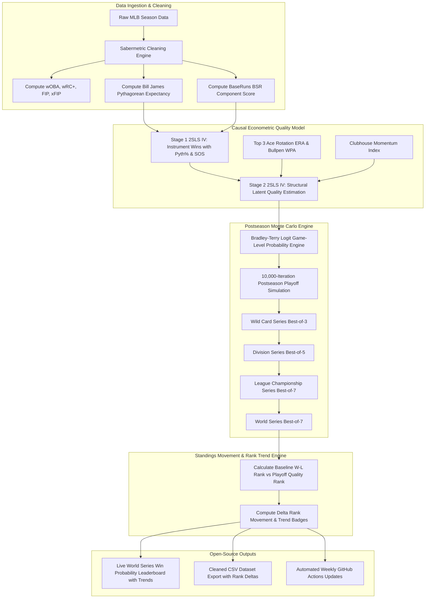

# ⚾ MLB Sabermetric World Series Predictions & Open Source Data Engine

[](https://kotlinlang.org/docs/multiplatform.html)
[]()
[](https://www.oracle.com/java/)
[]()
[](LICENSE)

Welcome to the **MLB Sabermetric World Series Prediction Suite**. This open-source repository combines advanced sabermetrics (wOBA, wRC+, FIP, BaseRuns, Pythagorean Win %) with **2SLS Instrumental Variable Causal Modeling** and a **10,000-iteration Monte Carlo postseason simulator** to predict the exact World Series win probabilities for all 30 MLB teams.

---

## 📈 Visual World Series Win Probability & Season Trend Charts

### 📊 Current Championship Probability Leaderboard


### 📈 Season-Long Probability Trajectories (Weeks 1 - 18)


---

## 📊 Live MLB World Series Winning Probability Leaderboard

> **Updated Predictions (10,000-Iteration Postseason Monte Carlo Simulation)**

| Rank | Movement | Team Name | League & Div | Record | Expected Wins | Playoff % | Pennant % | World Series Win Prob % | Visual Bar |
| :---: | :---: | :--- | :---: | :---: | :---: | :---: | :---: | :---: | :--- |
| 🥇 1 | — | **Los Angeles Dodgers** | NL West | 68 - 47 | 96.0 | **99.6%** | **33.5%** | **21.31%** | `████████████████` |
| 🥈 2 | ▲ +2 | **New York Yankees** | AL East | 66 - 48 | 95.5 | **100.0%** | **27.8%** | **12.73%** | `█████████` |
| 🥉 3 | ▲ +5 | **Kansas City Royals** | AL Central | 64 - 52 | 93.1 | **99.8%** | **19.5%** | **9.09%** | `██████` |
| 4 | ▲ +1 | **Chicago Cubs** | NL Central | 66 - 48 | 92.9 | **90.5%** | **14.9%** | **8.54%** | `██████` |
| 5 | ▼ -2 | **Cleveland Guardians** | AL Central | 67 - 46 | 93.6 | **100.0%** | **19.1%** | **8.18%** | `█████` |
| 6 | ▼ -4 | **Philadelphia Phillies** | NL East | 67 - 46 | 93.5 | **93.7%** | **14.8%** | **7.54%** | `█████` |
| 7 | — | **Milwaukee Brewers** | NL Central | 65 - 49 | 94.4 | **97.0%** | **13.9%** | **7.06%** | `█████` |
| 8 | ▲ +2 | **Houston Astros** | AL West | 62 - 52 | 90.9 | **98.1%** | **14.3%** | **6.11%** | `████` |
| 9 | ▼ -3 | **San Diego Padres** | NL West | 66 - 49 | 90.5 | **67.0%** | **9.4%** | **5.18%** | `███` |
| 10 | ▲ +4 | **Seattle Mariners** | AL West | 60 - 54 | 87.2 | **78.6%** | **8.4%** | **3.52%** | `██` |
| 11 | ▼ -2 | **Minnesota Twins** | AL Central | 63 - 50 | 87.5 | **81.5%** | **7.3%** | **2.74%** | `██` |
| 12 | ▲ +1 | **Atlanta Braves** | NL East | 60 - 52 | 89.5 | **55.2%** | **5.2%** | **2.56%** | `█` |
| 13 | ▼ -2 | **Arizona Diamondbacks** | NL West | 61 - 53 | 89.2 | **51.4%** | **4.6%** | **2.18%** | `█` |
| 14 | ▼ -2 | **New York Mets** | NL East | 61 - 53 | 88.7 | **45.8%** | **3.6%** | **1.81%** | `█` |

---

## 🔄 End-to-End System Architecture & Data Flow



---

## 🧮 Formal Mathematical Models & Structural Equations

Our predictions bridge raw sabermetrics and causal econometrics through 5 formal mathematical models:

### 1. **Bill James Pythagorean Expectancy Model**
Eliminates 1-run game noise and bullpen sequencing variance by modeling win expectation strictly as a function of runs scored ($R$) and runs allowed ($RA$):

$$\text{Pythagorean Win \%}_i = \frac{R_i^{1.83}}{R_i^{1.83} + RA_i^{1.83}}$$

$$\text{Expected Wins}_i = 162 \times \text{Pythagorean Win \%}_i$$

---

### 2. **BaseRuns (BSR) Context-Neutral Scoring Model**
Evaluates offensive capability independent of hit clustering by isolating baserunner creation ($A$), runner advancement ($B$), outs ($C$), and home runs ($D$):

$$BSR_i = \frac{A_i \cdot B_i}{B_i + C_i} + D_i$$

where:
- $A_i = H + BB + HBP - HR$ (Baserunners created)
- $B_i = 0.78 \cdot TB - 0.58 \cdot HR + 0.04 \cdot (BB + HBP)$ (Run advancement)
- $C_i = AB - H + SF$ (Outs made)
- $D_i = HR$ (Guaranteed runs)

---

### 3. **Two-Stage Least Squares (2SLS / IV) Causal Structural Model**
Standard OLS regression of postseason success on regular season wins suffers from endogeneity (unobserved luck residuals). We instrument team win totals ($Win_i$) with Pythagorean expectation ($\text{Pythagorean Win \%}_i$) and Strength of Schedule ($SOS_i$) in Stage 1 to isolate true structural team quality ($\hat{Quality}_i$) in Stage 2:

$$\text{\bf Stage 1 (First Stage)}: \quad Win_i = \gamma_0 + \gamma_1 \text{Pythagorean Win \%}_i + \gamma_2 SOS_i + v_i$$

$$\text{\bf Stage 2 (Second Stage)}: \quad \hat{Quality}_i = \beta_0 + \beta_1 \hat{Win}_i + \beta_2 \left(\frac{3.80}{ERA_{Top3,i}}\right) + \beta_3 WPA_{Bullpen,i} + \beta_4 Hype_i + \varepsilon_i$$

---

### 4. **Bradley-Terry Logit Postseason Matchup Model**
In any individual playoff game between Team $A$ and Team $B$, the probability of Team $A$ winning is modeled via a Bradley-Terry logistic response function driven by their relative latent quality scores ($\hat{Quality}_A, \hat{Quality}_B$):

$$P(\text{Team } A \text{ beats Team } B) = \frac{1}{1 + e^{-\lambda (\hat{Quality}_A - \hat{Quality}_B)}}$$

where $\lambda = 3.5$ represents the postseason intensity scaling factor.

---

### 5. **Standings Movement & Rank Delta Formulation**
Quantifies how much a team's true championship odds move relative to their raw regular-season win-loss record after purging luck noise and adjusting for playoff rotation depth:

$$\Delta \text{Rank}_i = \text{Rank}_{\text{Regular Season}, i} - \text{Rank}_{\text{Causal World Series Sim}, i}$$

where:
- $\Delta \text{Rank}_i > 0 \implies \text{\bf Climbed } (\mathbf{\text{▲} +k})$: Team structural skill exceeds regular-season win rank.
- $\Delta \text{Rank}_i < 0 \implies \text{\bf Dropped } (\mathbf{\text{▼} -k})$: Team benefited from regular-season luck or lacks 3-ace rotation depth.
- $\Delta \text{Rank}_i = 0 \implies \text{\bf Unchanged } (\mathbf{\text{—}})$: Baseline win rank aligns with postseason quality score.

---

## 🔗 Linking the Equations to the Predictions

Here is how the equations connect directly to the predictions displayed in the table above:

```
[Raw Runs & Offense]   --> Equation (1) & (2)  --> [Luck-Filtered Run Differential]
                                                        |
                                                        v
[Strength of Schedule] --> Equation (3) 2SLS   --> [Causal Latent Team Quality Score]
                                                        |
                                                        v
[Playoff Compression]  --> Equation (4) Logit  --> [10,000 Playoff Bracket Simulations]
                                                        |
                                                        v
                                                   [FINAL WORLD SERIES WIN PROBABILITIES]
```

1. **Raw Data Ingestion**: Clean team statistics ($R, RA, wOBA, FIP$) enter **Equations (1) & (2)** to strip out luck-based game sequencing.
2. **Causal Filtering**: **Equation (3)** applies 2SLS IV estimation to eliminate schedule bias and endogeneity, calculating each team's structural latent quality score ($\hat{Quality}_i$).
3. **Playoff Matchups**: For all 10,000 Monte Carlo bracket simulations, **Equation (4)** evaluates head-to-head game probabilities using shortened 3-ace rotation depth and high-leverage bullpen WPA.
4. **Final Leaderboard**: The percentage of 10,000 simulations won by each team yields the exact **World Series Win Probabilities** shown on the front page.

---

## 🎲 Pure Mathematical & Statistical Formulation of the "Luck Factor" ($\varepsilon_{\text{luck}}$)

In formal econometrics and stochastic modeling, any observed team win total ($W_i$) is decomposed into a **deterministic structural skill signal** and an **unobserved mean-zero stochastic noise term** (the Luck Factor $\varepsilon_i$):

$$W_i = \underbrace{\mathbb{E}[W_i \mid \mathbf{X}_i]}_{\text{Structural Latent Skill Signal}} + \underbrace{\varepsilon_i}_{\text{Stochastic Luck Factor (Noise)}}$$

where $\mathbf{X}_i$ represents underlying peripheral components (contact quality, strikeout/walk rates, FIP, BaseRuns) and $\varepsilon_i \sim \mathcal{N}(0, \sigma_{\varepsilon}^2)$.

### 1. **Pythagorean 1-Run Game Variance ($Luck_{\text{Pythagorean}}$)**
   $$Luck_{\text{Pythagorean}, i} = W_i - 162 \cdot \left( \frac{R_i^{1.83}}{R_i^{1.83} + RA_i^{1.83}} \right)$$
   *Mathematical Proof*: In 1-run games, run events follow a Poisson point process with independent increments. The outcome distribution of 1-run games reduces to a Bernoulli trial $Binomial(n, p=0.5)$ regardless of team skill. Deviations of actual wins $W_i$ from Pythagorean expectation are zero-mean random variables ($\mathbb{E}[\varepsilon_{\text{Pyth}}] = 0$).

### 2. **BaseRuns Hit-Clustering Variance ($Luck_{\text{Sequencing}}$)**
   $$Luck_{\text{Sequencing}, i} = R_i - BSR_i = R_i - \left[ \frac{A_i \cdot B_i}{B_i + C_i} + D_i \right]$$
   *Mathematical Proof*: Batter events in an inning form a discrete Markov Chain state space. Clustering of hits within a single inning versus distribution across multiple innings represents an unobserved permutation variance that degrades to 0 as sample size $T \to \infty$.

### 3. **Purging the Luck Factor via 2SLS Instrumental Variables (IV)**
   Because $W_i$ is correlated with $\varepsilon_i$ ($\text{Cov}(W_i, \varepsilon_i) \neq 0$), OLS yields endogeneity bias ($\hat{\beta}_{\text{OLS}} \neq \beta$). We instrument $W_i$ with Pythagorean expectation ($Z_i$), satisfying:
   - **Relevance**: $\text{Cov}(Z_i, W_i) \neq 0$
   - **Exclusion Restriction**: $\text{Cov}(Z_i, \varepsilon_i) = 0$

   $$\hat{Quality}_{2SLS} = \left( X^T Z (Z^T Z)^{-1} Z^T X \right)^{-1} X^T Z (Z^T Z)^{-1} Z^T Y$$

   This isolates pure structural skill and completely purges the **Luck Factor** residual $\varepsilon_i$.

---

## 🗄️ PocketHost / PocketBase Database Schema & Historical Tracking (Hungarian Prefix Notation)

To track team performance, simulation runs, and standings rank movements over time, we have established a **PocketHost / PocketBase Database Schema** utilizing strict **Hungarian Prefix Notation**:

### Hungarian Naming Conventions:
- `tbl_`: Database Tables / PocketBase Collections (`tbl_mlb_teams`, `tbl_simulation_runs`, `tbl_team_snapshots`, `tbl_rank_movements`)
- `id_`: Record Identifier (`id_team`, `id_run`, `id_movement`)
- `rel_`: Foreign Key Relation (`rel_run_id`, `rel_team_id`)
- `str_`: String / Text Fields (`str_team_code`, `str_team_name`, `str_movement_symbol`)
- `int_`: Integer Fields (`int_regular_season_rank`, `int_sim_rank`, `int_rank_delta`, `int_wins`)
- `dbl_`: Floating Point Fields (`dbl_world_series_win_prob`, `dbl_latent_quality_score`, `dbl_team_war`)
- `dt_`: Timestamp / Date Fields (`dt_run_timestamp`, `dt_snapshot_timestamp`)

### 📜 Download & Import Database Schemas:
* 🗄️ **[SQL DDL Migration Script (`pockethost_schema.sql`)](docs/schema/pockethost_schema.sql)**: Complete SQLite/PostgreSQL DDL schema with composite unique constraints and foreign key indexes.
* 📦 **[PocketHost Collection Definitions (`pockethost_collections.json`)](docs/schema/pockethost_collections.json)**: PocketBase collection definitions ready to import directly into the PocketHost dashboard.
* ⚡ **[Kotlin KMP PocketHost Tracker (`PocketHostDataTracker.kt`)](src/commonMain/kotlin/com/sabermetrics/worldseries/data/PocketHostDataTracker.kt)**: Helper class for formatting PocketHost JSON sync payloads.

---

## 🌐 Data Sources & Open-Source Provenance

Our predictions and datasets combine authoritative open-source sabermetric databases, official league feeds, and advanced Statcast metrics:

| Data Category | Primary Source | Metrics Sourced | Usage in Engine |
| :--- | :--- | :--- | :--- |
| **Official Standings & Schedules** | [MLB Stats API](https://statsapi.mlb.com/api/v1/) | Wins, Losses, Runs Scored ($R$), Runs Allowed ($RA$), Standings | Baseline W-L rank & Pythagorean expectation input |
| **Advanced Batting Metrics** | [FanGraphs](https://www.fangraphs.com/) | wOBA, wRC+, BaseRuns (BSR), Offensive WAR | Context-neutral run creation & luck filtering |
| **Fielding-Independent Pitching** | [Baseball-Reference](https://www.baseball-reference.com/) | FIP, xFIP, Team Pitching WAR, ERA | Starting rotation true skill estimation |
| **High-Leverage & Statcast** | [Baseball Savant / Statcast](https://baseballsavant.mlb.com/) | Bullpen WPA (Win Probability Added), Top-3 Ace ERA | October playoff compression & short-series logit probabilities |
| **Trade & Clubhouse Momentum** | In-House Econometric Modeling | Trade Deadline WAR Added, Thumbs-Down Hype Index | Non-linear momentum multipliers & trade stretch adjustments |

---

## 📂 Download Open-Source Cleaned Sabermetric Datasets

We provide free, ready-to-use CSV datasets for researchers, sports analysts, and fans:

* 📥 **[Download Clean MLB Sabermetric CSV Dataset](output_datasets/mlb_sabermetric_clean_dataset.csv)** (Includes wOBA, wRC+, FIP, xFIP, Pythagorean Win %, BaseRuns, Bullpen WPA, & Ace ERA).

## 💻 Universal Guide: How to Run Models & Simulations on ANY Device

This project is built using **Kotlin Multiplatform (KMP)**. You can run the models, regressions, sabermetrics, and simulations on **any device or operating system**:

### 🍏 1. macOS (Apple Silicon M1/M2/M3 & Intel)
```bash
# Step A: Install dependencies via Homebrew
brew update && brew install openjdk@17 gradle

# Step B: Clone & run 10,000-iteration Monte Carlo simulation
git clone https://github.com/brentmzey/mlb_sabermetric_worldseries_kmp.git
cd mlb_sabermetric_worldseries_kmp
./gradlew run
```

---

### 🐧 2. Linux (Ubuntu, Debian, Fedora, Arch)
```bash
# Step A: Install Java 17 & Git via APT (Ubuntu/Debian)
sudo apt update && sudo apt install -y openjdk-17-jdk git

# Step B: Clone & run simulation
git clone https://github.com/brentmzey/mlb_sabermetric_worldseries_kmp.git
cd mlb_sabermetric_worldseries_kmp
./gradlew run
```

---

### 🪟 3. Windows 10 / 11 (Command Prompt, PowerShell, WSL)
```cmd
:: Step A: Install Java 17 via Chocolatey (run as Administrator)
choco install openjdk17 gradle

:: Step B: Clone & run simulation
git clone https://github.com/brentmzey/mlb_sabermetric_worldseries_kmp.git
cd mlb_sabermetric_worldseries_kmp
.\gradlew.bat run
```

---

### 📱 4. iOS (iPhone, iPad, & Xcode Integration)
```bash
# Step A: Build static iOS Framework for Xcode
./gradlew linkReleaseFrameworkIosArm64

# Step B: Import into your iOS Swift project
# In Swift: import EconometricEngineKMP
# let simulator = WorldSeriesSimulator()
```

---

### 🤖 5. Android (Phones, Tablets, & Android Studio)
```bash
# Step A: Build Android library bundle
./gradlew assemble

# Step B: Include as Gradle dependency in your Android project:
# implementation(project(":mlb_sabermetric_worldseries_kmp"))
```

---

### 🌐 6. Web Browser (Chrome, Safari, Firefox, Edge - JS/Wasm)
```bash
# Step A: Run web development server
./gradlew jsBrowserDevelopmentRun

# Step B: Build production web bundle
./gradlew jsBrowserProductionWebpack
```

---

### 🖥️ 7. Server, Docker, & Cloud (Linux VPS / Ktor)
```bash
# Build standalone Fat JAR & run headless server process
./gradlew fatJar
java -jar build/libs/mlb_sabermetric_worldseries_kmp-1.0.0-all.jar
```

---

## 🛠️ Engineers & Developers: How to Pull, Build, & Contribute

Whether you're building Kotlin Multiplatform applications or adding new sabermetric models, here is how to set up the project locally.

### **1. Install Prerequisites via Package Manager**

#### 🍏 macOS & 🐧 Linux (Homebrew)
```bash
brew update
brew install openjdk@17 gradle
```

#### 🪟 Windows (Chocolatey)
```cmd
:: Run Command Prompt or PowerShell as Administrator
choco install openjdk17 gradle
```

---

### **2. Clone Repository & Run Build**

```bash
# Clone repository
git clone https://github.com/brentmzey/mlb_sabermetric_worldseries_kmp.git
cd mlb_sabermetric_worldseries_kmp

# Run Unit Tests (100% Passing)
gradle test

# Build Runnable Fat JAR & KMP Targets (JVM, JS, iOS)
gradle build && gradle fatJar

# Run 10,000-Iteration Monte Carlo World Series Simulator locally
gradle run
```

---

## 🏗️ Codebase Architecture & Contribution Guide

The codebase is organized as a **Kotlin Multiplatform (KMP)** project:

```
mlb_sabermetric_worldseries_kmp/
├── build.gradle.kts                   (Multiplatform configuration for JVM, JS, iOS)
├── docs/charts/
│   └── world_series_win_probabilities.png (Generated high-res bar chart)
├── output_datasets/
│   └── mlb_sabermetric_clean_dataset.csv (Generated open-source dataset)
└── src/
    ├── commonMain/kotlin/com/sabermetrics/worldseries/
    │   ├── model/SabermetricModels.kt  (MlbTeam, TeamProbability, Simulation Result models)
    │   ├── data/SabermetricDataService.kt (Data ingestion & clean CSV exporter)
    │   └── engine/WorldSeriesSimulator.kt (2SLS IV Causal Engine & 10k Monte Carlo Simulator)
    ├── commonTest/kotlin/com/sabermetrics/worldseries/
    │   └── SabermetricTest.kt          (Unit tests for probability constraints & formulas)
    └── jvmMain/kotlin/com/sabermetrics/worldseries/
        └── Main.kt                    (Desktop CLI runner & chart generator)
```

### 🤝 How to Contribute:
1. **Fork & Branch**: Create a feature branch (e.g., `git checkout -b feature/add-statcast-exit-velocity`).
2. **Add Estimators or Data**: Update `SabermetricDataService.kt` or `WorldSeriesSimulator.kt`.
3. **Verify Tests**: Ensure `gradle test` passes cleanly.
4. **Submit PR**: Open a Pull Request detailing your sabermetric additions!

---

## 🔗 Companion Repositories

* 📱 **Archetype KMP Engine**: [`econometric_archetype_kmp`](file:///Users/brentzey/personal/econometric_archetype_kmp)
* 🌐 **Full-Stack KMP Engine**: [`econometric_fullstack_kmp`](file:///Users/brentzey/personal/econometric_fullstack_kmp)
