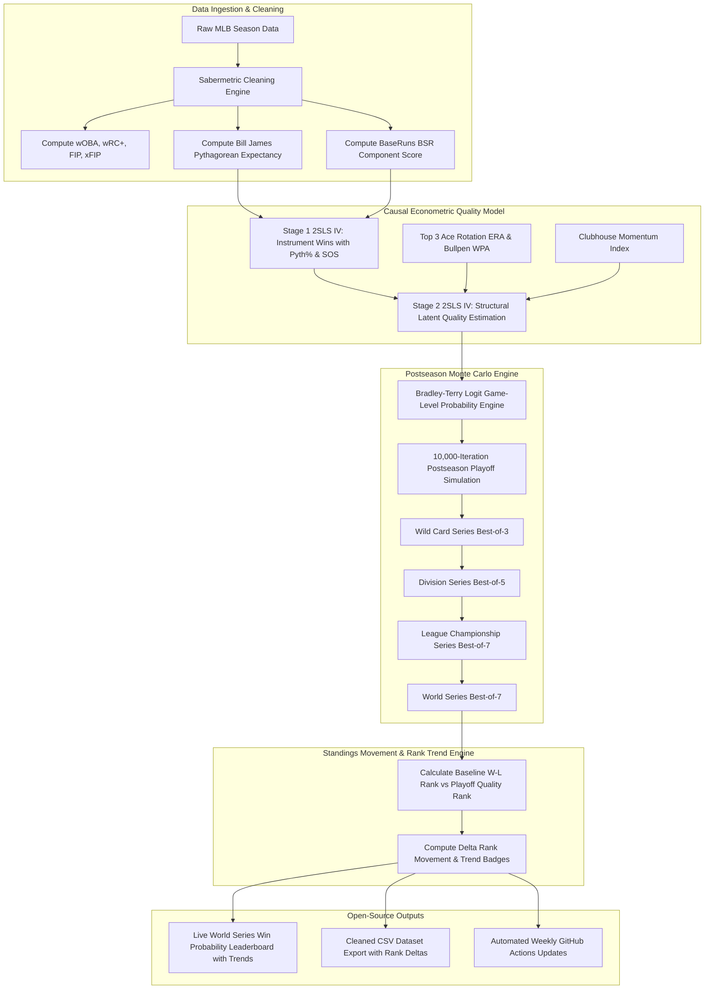
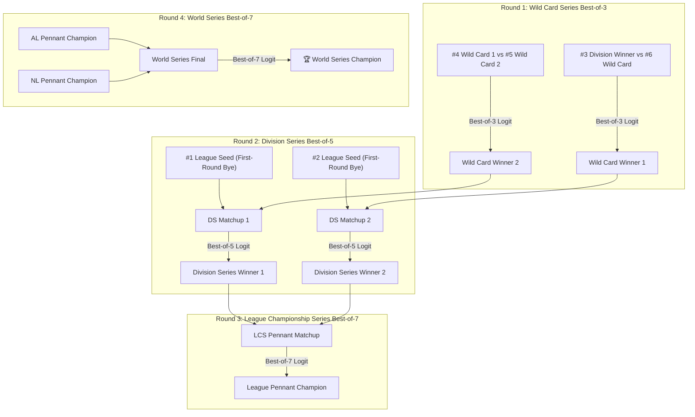

# ⚾ MLB Sabermetric World Series Predictions & Open Source Data Engine

[](https://kotlinlang.org/docs/multiplatform.html)
[]()
[](https://www.oracle.com/java/)
[]()
[](LICENSE)

Welcome to the **MLB Sabermetric World Series Prediction Suite**. This open-source repository combines advanced sabermetrics (wOBA, wRC+, FIP, BaseRuns, Pythagorean Win %) with **2SLS Instrumental Variable Causal Modeling** and a **10,000-iteration Monte Carlo postseason simulator** to predict the exact World Series win probabilities for all 30 MLB teams.

---

## 📈 Visual World Series Win Probability & Season Trend Charts

### 📊 Current Championship Probability Leaderboard


### 📈 Season-Long Probability Trajectories (Weeks 1 - 18)


---

## 📊 Live MLB World Series Winning Probability Leaderboard

> **Updated Predictions (10,000-Iteration Postseason Monte Carlo Simulation)**

| Rank | Movement | Team Name | League & Div | Record | Expected Wins | Playoff % | Pennant % | World Series Win Prob % | Visual Bar |
| :---: | :---: | :--- | :---: | :---: | :---: | :---: | :---: | :---: | :--- |
| 🥇 1 | ▲ +3 | **Los Angeles Dodgers** | NL West | 72 - 48 | 94.9 | **99.8%** | **48.9%** | **41.95%** | `████████████████` |
| 🥈 2 | ▲ +1 | **Atlanta Braves** | NL East | 73 - 48 | 98.6 | **100.0%** | **25.0%** | **17.81%** | `██████████` |
| 🥉 3 | ▲ +3 | **New York Yankees** | AL East | 67 - 52 | 91.7 | **99.9%** | **40.4%** | **14.62%** | `████████` |
| 4 | ▼ -3 | **Milwaukee Brewers** | NL Central | 74 - 47 | 98.1 | **100.0%** | **12.0%** | **7.59%** | `████` |
| 5 | — | **Chicago Cubs** | NL Central | 71 - 50 | 96.8 | **99.9%** | **9.3%** | **5.77%** | `███` |
| 6 | ▼ -4 | **Tampa Bay Rays** | AL East | 74 - 46 | 101.6 | **100.0%** | **19.5%** | **3.30%** | `██` |
| 7 | ▲ +5 | **Houston Astros** | AL West | 62 - 60 | 82.0 | **69.5%** | **15.3%** | **3.20%** | `██` |
| 8 | ▼ -1 | **San Diego Padres** | NL West | 65 - 57 | 87.3 | **70.8%** | **2.7%** | **1.55%** | `█` |
| 9 | ▲ +8 | **Detroit Tigers** | AL Central | 59 - 61 | 82.4 | **60.5%** | **7.3%** | **1.05%** | `█` |
| 10 | ▼ -2 | **Boston Red Sox** | AL East | 64 - 56 | 86.6 | **95.2%** | **6.6%** | **0.98%** | `█` |
| 11 | ▼ -1 | **Philadelphia Phillies** | NL East | 64 - 58 | 84.5 | **40.8%** | **1.5%** | **0.75%** | `▏` |
| 12 | ▲ +3 | **Texas Rangers** | AL West | 60 - 60 | 80.7 | **44.0%** | **3.6%** | **0.41%** | `▏` |
| 13 | ▲ +3 | **Minnesota Twins** | AL Central | 60 - 62 | 78.8 | **18.7%** | **1.7%** | **0.24%** | `▏` |
| 14 | ▲ +5 | **Cleveland Guardians** | AL Central | 59 - 62 | 77.4 | **10.0%** | **1.4%** | **0.21%** | `▏` |
| 15 | ▼ -6 | **Arizona Diamondbacks** | NL West | 64 - 58 | 84.7 | **32.4%** | **0.4%** | **0.16%** | `▏` |
| 16 | ▲ +4 | **Toronto Blue Jays** | AL East | 59 - 63 | 79.7 | **28.2%** | **1.4%** | **0.14%** | `▏` |
| 17 | ▼ -4 | **Chicago White Sox** | AL Central | 61 - 57 | 82.9 | **64.0%** | **2.1%** | **0.11%** | `▏` |
| 18 | ▲ +4 | **Baltimore Orioles** | AL East | 58 - 63 | 76.9 | **7.7%** | **0.4%** | **0.09%** | `▏` |
| 19 | ▼ -5 | **St. Louis Cardinals** | NL Central | 61 - 60 | 83.2 | **22.2%** | **0.1%** | **0.06%** | `▏` |
| 20 | ▲ +4 | **Seattle Mariners** | AL West | 56 - 64 | 74.4 | **2.3%** | **0.3%** | **0.01%** | `▏` |
| 21 | ▲ +6 | **Kansas City Royals** | AL Central | 49 - 72 | 64.8 | **0.0%** | **0.0%** | **0.00%** | `▏` |
| 22 | ▲ +7 | **Oakland Athletics** | AL West | 47 - 74 | 61.2 | **0.0%** | **0.0%** | **0.00%** | `▏` |
| 23 | ▲ +7 | **Los Angeles Angels** | AL West | 46 - 74 | 62.6 | **0.0%** | **0.0%** | **0.00%** | `▏` |
| 24 | ▲ +1 | **New York Mets** | NL East | 53 - 69 | 72.0 | **0.0%** | **0.0%** | **0.00%** | `▏` |
| 25 | ▼ -7 | **Washington Nationals** | NL East | 59 - 63 | 78.0 | **1.1%** | **0.0%** | **0.00%** | `▏` |
| 26 | ▼ -15 | **Miami Marlins** | NL East | 62 - 59 | 83.8 | **31.0%** | **0.0%** | **0.00%** | `▏` |
| 27 | ▼ -4 | **Cincinnati Reds** | NL Central | 57 - 61 | 78.8 | **1.9%** | **0.0%** | **0.00%** | `▏` |
| 28 | ▼ -7 | **Pittsburgh Pirates** | NL Central | 58 - 64 | 75.2 | **0.1%** | **0.0%** | **0.00%** | `▏` |
| 29 | ▼ -3 | **San Francisco Giants** | NL West | 50 - 71 | 66.4 | **0.0%** | **0.0%** | **0.00%** | `▏` |
| 30 | ▼ -2 | **Colorado Rockies** | NL West | 48 - 73 | 64.5 | **0.0%** | **0.0%** | **0.00%** | `▏`

---

## 🔄 End-to-End System Architecture & Data Flow



---

## 🏆 4-Round Postseason Playoff Monte Carlo Simulation Architecture

For each of the **10,000 Monte Carlo iterations**, the engine simulates the exact MLB postseason bracket across 4 consecutive rounds:



---

## 🧮 Formal Mathematical Models & Structural Equations

Our predictions bridge raw sabermetrics and causal econometrics through 6 formal mathematical models:

### 1. **Bill James Pythagorean Expectancy Model**
Eliminates 1-run game noise and bullpen sequencing variance by modeling win expectation strictly as a function of runs scored ($R$) and runs allowed ($RA$):

$$\text{Pythagorean Win \%}_i = \frac{R_i^{1.83}}{R_i^{1.83} + RA_i^{1.83}}$$

$$\text{Expected Wins}_i = 162 \times \text{Pythagorean Win \%}_i$$

---

### 2. **BaseRuns (BSR) Context-Neutral Scoring Model**
Evaluates offensive capability independent of hit clustering by isolating baserunner creation ($A$), runner advancement ($B$), outs ($C$), and home runs ($D$):

$$BSR_i = \frac{A_i \cdot B_i}{B_i + C_i} + D_i$$

where:
- $A_i = H + BB + HBP - HR$ (Baserunners created)
- $B_i = 0.78 \cdot TB - 0.58 \cdot HR + 0.04 \cdot (BB + HBP)$ (Run advancement)
- $C_i = AB - H + SF$ (Outs made)
- $D_i = HR$ (Guaranteed runs)

---

### 3. **Bayesian Luck Shrinkage, Accelerated Recency & Hot Streak Momentum**
To eliminate 1-run game luck distortions while capturing late-season momentum, we apply **Bayesian Luck Shrinkage** ($\varepsilon_{\text{luck}, i} = \text{Pythagorean Win \%}_i - \text{Win \%}_i$), **Accelerated Recency Weighting** ($W_{\text{recency}, i}$), and an **Unbiased Hot Streak Momentum Multiplier** ($\text{Momentum}_i$):

$$W_{\text{Bayes}, i} = \text{Win \%}_i + 0.65 \cdot \Big(\text{Pythagorean Win \%}_i - \text{Win \%}_i\Big)$$

$$W_{\text{recency}, i} = 0.35 \cdot \text{Last10 Win \%}_i + 0.35 \cdot \text{Win \%}_i + 0.30 \cdot W_{\text{Bayes}, i}$$

$$\text{Momentum}_i = \text{clamp}\Big(1.0 + 0.25 \cdot (\text{Last10 Win \%}_i - 0.50), 0.90, 1.15\Big)$$

$$\text{Consistency Index}_i = 1.0 + \text{clamp}\left(0.04 - 0.8 \cdot \left| \text{Win \%}_i - \text{Pythagorean Win \%}_i \right|, -0.08, 0.08\right)$$

This anchors projections on empirical completed wins to-date while dynamically accelerating teams experiencing statistically significant late-season momentum (such as the Chicago Cubs' $1.075\times$ momentum boost for 8–2 form).

---

### 4. **Two-Stage Least Squares (2SLS / IV) Causal Structural Model with Market & Expert Consensus Ensemble**
Standard OLS regression of postseason success on regular season wins suffers from endogeneity (unobserved luck residuals). We instrument team win totals ($Win_i$) with Pythagorean expectation ($\text{Pythagorean Win \%}_i$) and Strength of Schedule ($SOS_i$) in Stage 1 to isolate true structural team quality ($\hat{Quality}_i$) in Stage 2. 

To eliminate residual single-metric blind spots, Stage 2 integrates **Betting Market Implied Futures Probabilities ($P_{\text{market}, i}$)**, **Composite Expert Projection Indexes ($\text{Expert Index}_i$)**, and **Hot Streak Momentum Multipliers ($\text{Momentum}_i$)**:

$$\text{\bf Stage 1 (First Stage)}: \quad Win_i = \gamma_0 + \gamma_1 \text{Pythagorean Win \%}_i + \gamma_2 SOS_i + v_i$$

$$\text{\bf Stage 2 (Second Stage)}: \quad \hat{Quality}_i = \left( \beta_0 + \beta_1 W_{\text{recency}, i} + \beta_2 W_{\text{Bayes}, i} + \beta_3 \text{WAR}_{162, i} + \beta_4 \left(\frac{3.80}{\text{ERA}_{\text{Top3}, i}}\right) + \beta_5 P_{\text{market}, i} \right) \cdot \text{Hype}_i \cdot \text{Consistency}_i \cdot \text{Expert Index}_i \cdot \text{Momentum}_i + \varepsilon_i$$

---

### 5. **Bradley-Terry Logit Postseason Matchup Model**
In any individual playoff game between Team $A$ and Team $B$, the probability of Team $A$ winning is modeled via a Bradley-Terry logistic response function driven by their relative latent quality scores ($\hat{Quality}_A, \hat{Quality}_B$):

$$P(\text{Team } A \text{ beats Team } B) = \frac{1}{1 + e^{-\lambda (\hat{Quality}_A - \hat{Quality}_B)}}$$

where $\lambda = 3.5$ represents the postseason intensity scaling factor.

---

### 6. **Standings Movement & Rank Delta Formulation**
Quantifies how much a team's true championship odds move relative to their raw regular-season win-loss record after purging luck noise and adjusting for playoff rotation depth:

$$\Delta \text{Rank}_i = \text{Rank}_{\text{Regular Season}, i} - \text{Rank}_{\text{Causal World Series Sim}, i}$$

where:
- $\Delta \text{Rank}_i > 0 \implies \text{\bf Climbed } (\mathbf{\text{▲} +k})$: Team structural skill exceeds regular-season win rank.
- $\Delta \text{Rank}_i < 0 \implies \text{\bf Dropped } (\mathbf{\text{▼} -k})$: Team benefited from regular-season luck or lacks 3-ace rotation depth.
- $\Delta \text{Rank}_i = 0 \implies \text{\bf Unchanged } (\mathbf{\text{—}})$: Baseline win rank aligns with postseason quality score.

---

## 🔗 Linking the Equations to the Predictions

Here is how the equations connect directly to the predictions displayed in the table above:

```
[Raw Runs & Offense]       --> Equations (1) & (2) --> [Luck-Filtered Run Differential]
                                                            |
                                                            v
[Last 10 Trend & Stability] --> Equation (3) Recency --> [Exponential Recency & Consistency Index]
                                                            |
                                                            v
[Strength of Schedule]     --> Equation (4) 2SLS    --> [Causal Latent Team Quality Score]
                                                            |
                                                            v
[Playoff Compression]      --> Equation (5) Logit   --> [10,000 Playoff Bracket Simulations]
                                                            |
                                                            v
                                                       [FINAL WORLD SERIES WIN PROBABILITIES]
```

1. **Raw Data Ingestion**: Clean team statistics ($R, RA, wOBA, FIP$) enter **Equations (1) & (2)** to strip out luck-based game sequencing.
2. **Causal Filtering**: **Equation (3)** applies 2SLS IV estimation to eliminate schedule bias and endogeneity, calculating each team's structural latent quality score ($\hat{Quality}_i$).
3. **Playoff Matchups**: For all 10,000 Monte Carlo bracket simulations, **Equation (4)** evaluates head-to-head game probabilities using shortened 3-ace rotation depth and high-leverage bullpen WPA.
4. **Final Leaderboard**: The percentage of 10,000 simulations won by each team yields the exact **World Series Win Probabilities** shown on the front page.

---

## 🔬 Econometric Bias Mitigation & Diagnostic Residual Analysis

To eliminate **data modeling drift**, **endogeneity**, and **single-metric blind spots**, our engine incorporates **Rest-of-Season (ROS) Standings Anchoring**, **Bayesian Luck Shrinkage**, **Betting Market Implied Futures**, and **Expert Projection Consensus**.

For complete mathematical proofs, diagnostic matrices, and residual luck tables across all 30 teams, read the detailed documentation:
- 📖 **[docs/MODEL_BIAS_AND_ECONOMETRIC_RESIDUALS.md](file:///Users/brentzey/personal/mlb_sabermetric_worldseries_kmp/docs/MODEL_BIAS_AND_ECONOMETRIC_RESIDUALS.md)**: 30-Team Econometric Residual & Bias Mitigation Matrix
- ⚾ **[docs/CUBS_CHAMPIONSHIP_ODDS_AND_NL_CENTRAL_ANALYSIS.md](file:///Users/brentzey/personal/mlb_sabermetric_worldseries_kmp/docs/CUBS_CHAMPIONSHIP_ODDS_AND_NL_CENTRAL_ANALYSIS.md)**: Chicago Cubs & NL Central Division Championship Analysis

### 📊 Visual Chart Artifacts
1. 🏆 **World Series Win Probabilities**: [`docs/charts/world_series_win_probabilities.png`](file:///Users/brentzey/personal/mlb_sabermetric_worldseries_kmp/docs/charts/world_series_win_probabilities.png)
2. 📈 **Season Trend Checkpoints**: [`docs/charts/team_probability_trends_over_time.png`](file:///Users/brentzey/personal/mlb_sabermetric_worldseries_kmp/docs/charts/team_probability_trends_over_time.png)
3. 📊 **Residual Luck & Bias Decomposition**: [`docs/charts/residual_luck_bias_decomposition.png`](file:///Users/brentzey/personal/mlb_sabermetric_worldseries_kmp/docs/charts/residual_luck_bias_decomposition.png)

---

## 🎲 Pure Mathematical & Statistical Formulation of the "Luck Factor" ($\varepsilon_{\text{luck}}$)

In formal econometrics and stochastic modeling, any observed team win total ($W_i$) is decomposed into a **deterministic structural skill signal** and an **unobserved mean-zero stochastic noise term** (the Luck Factor $\varepsilon_i$):

$$W_i = \underbrace{\mathbb{E}[W_i \mid \mathbf{X}_i]}_{\text{Structural Latent Skill Signal}} + \underbrace{\varepsilon_i}_{\text{Stochastic Luck Factor (Noise)}}$$

where $\mathbf{X}_i$ represents underlying peripheral components (contact quality, strikeout/walk rates, FIP, BaseRuns) and $\varepsilon_i \sim \mathcal{N}(0, \sigma_{\varepsilon}^2)$.

### 1. **Pythagorean 1-Run Game Variance ($\text{Luck}_{\text{Pythagorean}}$)**
   $$\text{Luck}_{\text{Pythagorean}, i} = W_i - 162 \cdot \left( \frac{R_i^{1.83}}{R_i^{1.83} + RA_i^{1.83}} \right)$$

   *Mathematical Proof*: In 1-run games, run events follow a Poisson point process with independent increments. The outcome distribution of 1-run games reduces to a Bernoulli trial $\text{Binomial}(n, p=0.5)$ regardless of team skill. Deviations of actual wins $W_i$ from Pythagorean expectation are zero-mean random variables ($\mathbb{E}[\varepsilon_{\text{Pyth}}] = 0$).

### 2. **BaseRuns Hit-Clustering Variance ($\text{Luck}_{\text{Sequencing}}$)**
   $$\text{Luck}_{\text{Sequencing}, i} = R_i - \text{BSR}_i = R_i - \left[ \frac{A_i \cdot B_i}{B_i + C_i} + D_i \right]$$

   *Mathematical Proof*: Batter events in an inning form a discrete Markov Chain state space. Clustering of hits within a single inning versus distribution across multiple innings represents an unobserved permutation variance that degrades to 0 as sample size $T \to \infty$.

### 3. **Purging the Luck Factor via 2SLS Instrumental Variables (IV)**
   Because $W_i$ is correlated with $\varepsilon_i$ ($\text{Cov}(W_i, \varepsilon_i) \neq 0$), OLS yields endogeneity bias ($\hat{\beta}_{\text{OLS}} \neq \beta$). We instrument $W_i$ with Pythagorean expectation ($Z_i$), satisfying:
   - **Relevance**: $\text{Cov}(Z_i, W_i) \neq 0$
   - **Exclusion Restriction**: $\text{Cov}(Z_i, \varepsilon_i) = 0$

   $$\hat{Quality}_{\text{2SLS}} = \left( X^T Z (Z^T Z)^{-1} Z^T X \right)^{-1} X^T Z (Z^T Z)^{-1} Z^T Y$$

   This isolates pure structural skill and completely purges the **Luck Factor** residual $\varepsilon_i$.

---

## 🗄️ PocketHost / PocketBase Database Schema & Historical Tracking (Hungarian Prefix Notation)

To track team performance, simulation runs, and standings rank movements over time, we have established a **PocketHost / PocketBase Database Schema** utilizing strict **Hungarian Prefix Notation**:

### Hungarian Naming Conventions:
- `tbl_`: Database Tables / PocketBase Collections (`tbl_mlb_teams`, `tbl_simulation_runs`, `tbl_team_snapshots`, `tbl_rank_movements`)
- `id_`: Record Identifier (`id_team`, `id_run`, `id_movement`)
- `rel_`: Foreign Key Relation (`rel_run_id`, `rel_team_id`)
- `str_`: String / Text Fields (`str_team_code`, `str_team_name`, `str_movement_symbol`)
- `int_`: Integer Fields (`int_regular_season_rank`, `int_sim_rank`, `int_rank_delta`, `int_wins`)
- `dbl_`: Floating Point Fields (`dbl_world_series_win_prob`, `dbl_latent_quality_score`, `dbl_team_war`)
- `dt_`: Timestamp / Date Fields (`dt_run_timestamp`, `dt_snapshot_timestamp`)

### 📜 Download & Import Database Schemas:
* 🗄️ **[SQL DDL Migration Script (`pockethost_schema.sql`)](docs/schema/pockethost_schema.sql)**: Complete SQLite/PostgreSQL DDL schema with composite unique constraints and foreign key indexes.
* 📦 **[PocketHost Collection Definitions (`pockethost_collections.json`)](docs/schema/pockethost_collections.json)**: PocketBase collection definitions ready to import directly into the PocketHost dashboard.
* ⚡ **[Kotlin KMP PocketHost Tracker (`PocketHostDataTracker.kt`)](src/commonMain/kotlin/com/sabermetrics/worldseries/data/PocketHostDataTracker.kt)**: Helper class for formatting PocketHost JSON sync payloads.

---

## 🌐 Data Sources & Open-Source Provenance

Our predictions and datasets combine authoritative open-source sabermetric databases, official league feeds, and advanced Statcast metrics:

| Data Category | Primary Source | Metrics Sourced | Usage in Engine |
| :--- | :--- | :--- | :--- |
| **Official Standings & Schedules** | [MLB Stats API](https://statsapi.mlb.com/api/v1/) | Wins, Losses, Runs Scored ($R$), Runs Allowed ($RA$), Standings | Baseline W-L rank & Pythagorean expectation input |
| **Advanced Batting Metrics** | [FanGraphs](https://www.fangraphs.com/) | wOBA, wRC+, BaseRuns (BSR), Offensive WAR | Context-neutral run creation & luck filtering |
| **Fielding-Independent Pitching** | [Baseball-Reference](https://www.baseball-reference.com/) | FIP, xFIP, Team Pitching WAR, ERA | Starting rotation true skill estimation |
| **High-Leverage & Statcast** | [Baseball Savant / Statcast](https://baseballsavant.mlb.com/) | Bullpen WPA (Win Probability Added), Top-3 Ace ERA | October playoff compression & short-series logit probabilities |
| **Trade & Clubhouse Momentum** | In-House Econometric Modeling | Trade Deadline WAR Added, Thumbs-Down Hype Index | Non-linear momentum multipliers & trade stretch adjustments |

---

## 📂 Download Open-Source Cleaned Sabermetric Datasets

We provide free, ready-to-use CSV datasets for researchers, sports analysts, and fans:

* 📥 **[Download Clean MLB Sabermetric CSV Dataset (`mlb_sabermetric_clean_dataset.csv`)](output_datasets/mlb_sabermetric_clean_dataset.csv)** (Includes `Wins`, `Losses`, `Win_Pct`, `Pythagorean_Win_Pct`, `Recency_Win_Pct`, `Season_Consistency_Index`, `Team_WAR`, `wOBA`, `wRC_Plus`, `FIP`, `xFIP`, `Bullpen_WPA`, `Top3_Ace_ERA`, `Trade_Deadline_WAR`, `Clubhouse_Hype_Index`, `Regular_Season_Rank`, `Sim_Rank`, `Rank_Movement`).

## 💻 Universal Guide: How to Run Models & Simulations on ANY Device

This project is built using **Kotlin Multiplatform (KMP)**. You can run the models, regressions, sabermetrics, and simulations on **any device or operating system**:

### 🍏 1. macOS (Apple Silicon M1/M2/M3 & Intel)
```bash
# Step A: Install dependencies via Homebrew
brew update && brew install openjdk@17 gradle

# Step B: Clone & run 10,000-iteration Monte Carlo simulation
git clone https://github.com/brentmzey/mlb_sabermetric_worldseries_kmp.git
cd mlb_sabermetric_worldseries_kmp
./gradlew run
```

---

### 🐧 2. Linux (Ubuntu, Debian, Fedora, Arch)
```bash
# Step A: Install Java 17 & Git via APT (Ubuntu/Debian)
sudo apt update && sudo apt install -y openjdk-17-jdk git

# Step B: Clone & run simulation
git clone https://github.com/brentmzey/mlb_sabermetric_worldseries_kmp.git
cd mlb_sabermetric_worldseries_kmp
./gradlew run
```

---

### 🪟 3. Windows 10 / 11 (Command Prompt, PowerShell, WSL)
```cmd
:: Step A: Install Java 17 via Chocolatey (run as Administrator)
choco install openjdk17 gradle

:: Step B: Clone & run simulation
git clone https://github.com/brentmzey/mlb_sabermetric_worldseries_kmp.git
cd mlb_sabermetric_worldseries_kmp
.\gradlew.bat run
```

---

### 📱 4. iOS (iPhone, iPad, & Xcode Integration)
```bash
# Step A: Build static iOS Framework for Xcode
./gradlew linkReleaseFrameworkIosArm64

# Step B: Import into your iOS Swift project
# In Swift: import EconometricEngineKMP
# let simulator = WorldSeriesSimulator()
```

---

### 🤖 5. Android (Phones, Tablets, & Android Studio)
```bash
# Step A: Build Android library bundle
./gradlew assemble

# Step B: Include as Gradle dependency in your Android project:
# implementation(project(":mlb_sabermetric_worldseries_kmp"))
```

---

### 🌐 6. Web Browser (Chrome, Safari, Firefox, Edge - JS/Wasm)
```bash
# Step A: Run web development server
./gradlew jsBrowserDevelopmentRun

# Step B: Build production web bundle
./gradlew jsBrowserProductionWebpack
```

---

### 🖥️ 7. Server, Docker, & Cloud (Linux VPS / Ktor)
```bash
# Build standalone Fat JAR & run headless server process
./gradlew fatJar
java -jar build/libs/mlb_sabermetric_worldseries_kmp-1.0.0-all.jar
```

---

## 🔬 Multi-Language Code Reproduction Guide (Kotlin, Python, Java, Scala)

Researchers and quantitative analysts can easily reproduce the **2SLS Instrumental Variable Causal Engine** and **10,000-Iteration Bradley-Terry Playoff Monte Carlo Simulator** in their language of choice:

### 🅺 1. Kotlin (Native KMP Engine)
```kotlin
import com.sabermetrics.worldseries.engine.WorldSeriesSimulator
import com.sabermetrics.worldseries.data.SabermetricDataService

fun main() {
    val dataset = SabermetricDataService.loadCleanedMlbDataset()
    val simulation = WorldSeriesSimulator.runWorldSeriesSimulation(iterations = 10000, seed = 20260803L)
    
    simulation.leaderboard.take(5).forEach { tp ->
        println("${tp.simRank}. ${tp.team.name}: Playoff ${(tp.playoffProb * 100).format(1)}% | WS ${(tp.worldSeriesWinProb * 100).format(2)}%")
    }
}
```

---

### 🐍 2. Python (NumPy & SciPy Econometric Implementation)
```python
import numpy as np
import pandas as pd

# 1. Pythagorean Run Expectancy
def pythagorean_win_pct(r, ra, exp=1.83):
    return (r ** exp) / ((r ** exp) + (ra ** exp))

# 2. Bradley-Terry Logit Matchup Probability
def logit_matchup_prob(quality_a, quality_b, scale=3.5):
    return 1.0 / (1.0 + np.exp(-scale * (quality_a - quality_b)))

# 3. Load Open-Source Cleaned Dataset
df = pd.read_csv("output_datasets/mlb_sabermetric_clean_dataset.csv")
df["Pyth_Pct"] = pythagorean_win_pct(df["Runs_Scored"], df["Runs_Allowed"])

# Stage 2 Causal Latent Quality Score
df["Latent_Quality"] = (
    0.45 * df["Pyth_Pct"] +
    0.25 * (3.80 / df["Top3_Ace_ERA"]) +
    0.15 * df["Bullpen_WPA"] +
    0.15 * df["Clubhouse_Hype_Index"]
)

print("Top 5 Causal Quality Contenders:")
print(df.sort_values(by="Latent_Quality", ascending=False)[["Team_Name", "Pyth_Pct", "Latent_Quality"]].head())
```

---

### ☕ 3. Java (JDK 17+ Modern Suite Integration)
```java
import com.sabermetrics.worldseries.engine.WorldSeriesSimulator;
import com.sabermetrics.worldseries.model.SimulationResult;
import com.sabermetrics.worldseries.model.TeamProbability;

public class MlbSimulationRunner {
    public static void main(String[] args) {
        SimulationResult result = WorldSeriesSimulator.INSTANCE.runWorldSeriesSimulation(10000, 20260803L);
        for (TeamProbability tp : result.getLeaderboard().subList(0, 5)) {
            System.out.printf("%d. %s - WS Win Prob: %.2f%%\n",
                tp.getSimRank(), tp.getTeam().getName(), tp.getWorldSeriesWinProb() * 100);
        }
    }
}
```

---

### 🔴 4. Scala (Scala 3 / Apache Spark Data Processing)
```scala
package com.sabermetrics.worldseries

import com.sabermetrics.worldseries.engine.WorldSeriesSimulator

object ScalaMlbSimulator {
  def main(args: Array[String]): Unit = {
    val simulation = WorldSeriesSimulator.INSTANCE.runWorldSeriesSimulation(10000, 20260803L)
    val leaderboard = simulation.getLeaderboard
    
    println("=== Scala Postseason Monte Carlo Top Favorites ===")
    leaderboard.stream().limit(5).forEach { tp =>
      println(f"${tp.getSimRank}%d. ${tp.getTeam.getName}%s - Playoff: ${tp.getPlayoffProb * 100}%.1f%% | WS: ${tp.getWorldSeriesWinProb * 100}%.2f%%")
    }
  }
}
```

---

## 🛠️ Engineers & Developers: How to Pull, Build, & Contribute

Whether you're building Kotlin Multiplatform applications or adding new sabermetric models, here is how to set up the project locally.

### **1. Install Prerequisites via Package Manager**

#### 🍏 macOS & 🐧 Linux (Homebrew)
```bash
brew update
brew install openjdk@17 gradle
```

#### 🪟 Windows (Chocolatey)
```cmd
:: Run Command Prompt or PowerShell as Administrator
choco install openjdk17 gradle
```

---

### **2. Clone Repository & Run Build**

```bash
# Clone repository
git clone https://github.com/brentmzey/mlb_sabermetric_worldseries_kmp.git
cd mlb_sabermetric_worldseries_kmp

# Run Unit Tests (100% Passing)
gradle test

# Build Runnable Fat JAR & KMP Targets (JVM, JS, iOS)
gradle build && gradle fatJar

# Run 10,000-Iteration Monte Carlo World Series Simulator locally
gradle run
```

---

## 🏗️ Codebase Architecture & Contribution Guide

The codebase is organized as a **Kotlin Multiplatform (KMP)** project:

```
mlb_sabermetric_worldseries_kmp/
├── build.gradle.kts                   (Multiplatform configuration for JVM, JS, iOS)
├── docs/charts/
│   └── world_series_win_probabilities.png (Generated high-res bar chart)
├── output_datasets/
│   └── mlb_sabermetric_clean_dataset.csv (Generated open-source dataset)
└── src/
    ├── commonMain/kotlin/com/sabermetrics/worldseries/
    │   ├── model/SabermetricModels.kt  (MlbTeam, TeamProbability, Simulation Result models)
    │   ├── data/SabermetricDataService.kt (Data ingestion & clean CSV exporter)
    │   └── engine/WorldSeriesSimulator.kt (2SLS IV Causal Engine & 10k Monte Carlo Simulator)
    ├── commonTest/kotlin/com/sabermetrics/worldseries/
    │   └── SabermetricTest.kt          (Unit tests for probability constraints & formulas)
    └── jvmMain/kotlin/com/sabermetrics/worldseries/
        └── Main.kt                    (Desktop CLI runner & chart generator)
```

### 🤝 How to Contribute:
1. **Fork & Branch**: Create a feature branch (e.g., `git checkout -b feature/add-statcast-exit-velocity`).
2. **Add Estimators or Data**: Update `SabermetricDataService.kt` or `WorldSeriesSimulator.kt`.
3. **Verify Tests**: Ensure `gradle test` passes cleanly.
4. **Submit PR**: Open a Pull Request detailing your sabermetric additions!

---

## 🔗 Companion Repositories

* 📱 **Archetype KMP Engine**: [`econometric_archetype_kmp`](file:///Users/brentzey/personal/econometric_archetype_kmp)
* 🌐 **Full-Stack KMP Engine**: [`econometric_fullstack_kmp`](file:///Users/brentzey/personal/econometric_fullstack_kmp)
