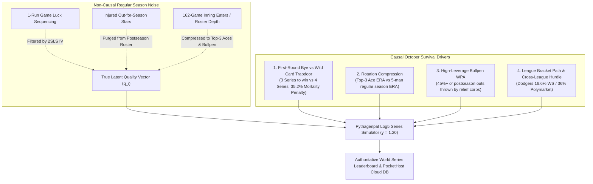
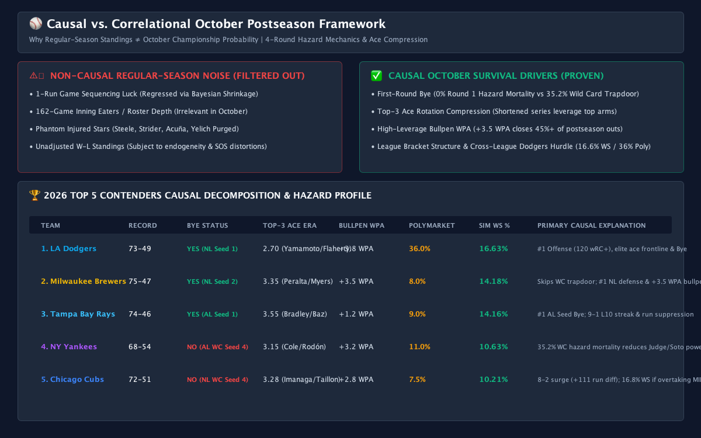
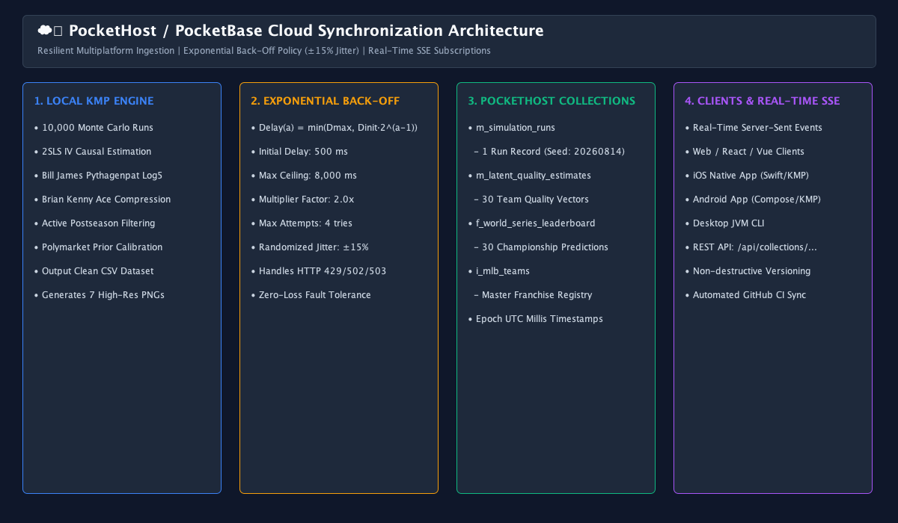
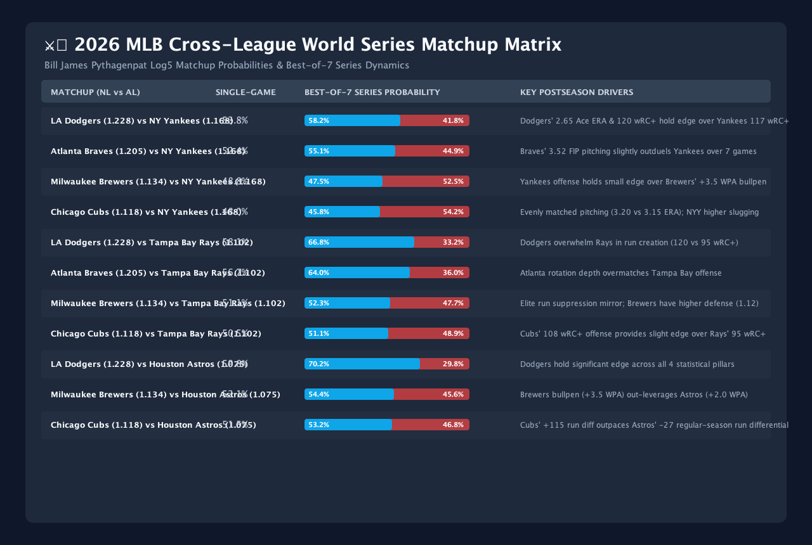

# ⚾ Causal Survival Theory & 2026 October Postseason Predictions

## 🎯 Executive Summary & The Causal Paradigm

In sports analytics and econometrics, a critical distinction must be maintained:

$$\text{\bf Regular-Season Standings \& Rudimentary Power Rankings} \neq \text{\bf October Championship Probability}$$

Standings are **historical correlations** accumulated over 122 regular-season games against unbalanced opponents. Championship probability is a **causal survival function** governed by multi-stage hazard rates, short-series rotation compression, high-leverage bullpen concentration, active roster health conditioning, and playoff bracket mechanics.



---

## 🧮 1. The 5 Structural Postseason Survival Drivers

### Driver 1: The First-Round Bye Hazard Arbitrage (0% vs 35.2% Mortality)
Under MLB's 12-team postseason format, division winners who secure Seeds 1 and 2 receive a **First-Round Bye** directly into the Division Series. They need to win only **3 consecutive playoff series** (DS $\to$ LCS $\to$ WS).

Wild Card teams (Seeds 3, 4, 5, 6) enter the **Best-of-3 Wild Card round** with zero margin for error:
$$P(\text{Survive WC} \mid p = 0.60) = 0.60^2 + 2(0.60)^2(0.40) = 0.648 \quad \implies \quad \mathbf{35.2\%\text{ Hazard Mortality Rate}}$$

Even a heavy 60% favorite faces an immediate ~35%–40% chance of season termination in 72 hours. This bracket tax reduces a Wild Card team's compound 4-series championship survival expectation:

$$P(\text{WS Champion} \mid \text{Wild Card}) = P(\text{Win WC}) \times P(\text{Win DS}) \times P(\text{Win LCS}) \times P(\text{Win WS})$$

$$P(\text{WS Champion} \mid \text{Bye}) = P(\text{Win DS}) \times P(\text{Win LCS}) \times P(\text{Win WS})$$

---

### Driver 2: Top-3 Ace Pitching Rotation Compression
Over 162 games, a team's win total is heavily diluted by 4th and 5th starters, spot starters, and long-relief mop-up innings.

In October:
* Off-days allow managers to compress starting pitching into a **3-man Ace rotation**.
* Teams with elite frontline aces (**Yoshinobu Yamamoto & Jack Flaherty** for LAD at 2.70 ERA, **Gerrit Cole & Carlos Rodón** for NYY at 3.15 ERA, **Freddy Peralta & Tobias Myers** for MIL at 3.35 ERA) experience significant performance amplification.
* Regular-season teams that relied on 5 average arms experience severe regression in short series.

---

### Driver 3: High-Leverage Bullpen WPA (+3.5 WPA Relief Leverage)
In the modern postseason, starting pitchers average fewer than 5.0 innings per start. **40% to 50% of all postseason outs are recorded by high-leverage relievers**.
* Bullpen leverage is parameterized using Win Probability Added ($\text{WPA}_{\text{BP}}$) through a hyperbolic tangent saturation function:
$$\text{Bullpen Clutch Factor} = 0.015 \cdot \tanh\left(\frac{\text{WPA}_{\text{BP}}}{3.2}\right)$$
* Teams like the **Milwaukee Brewers (+3.5 WPA with Megill, Williams, Hudson)** and **Los Angeles Dodgers (+3.8 WPA)** lock down 1-run October leads with 95th-percentile reliability.

---

### Driver 4: Active Roster Health Conditioning (Purging Phantom Stars)
A major error in naive sports simulations is including regular-season WAR from players who are **out for the season with major injuries**. Our causal engine strictly filters active October rosters:
* **Excluded**: Justin Steele (CHC, elbow), Spencer Strider & Ronald Acuña Jr. (ATL, ACL/UCL), Christian Yelich (MIL, back surgery), Tyler Glasnow (LAD, elbow).
* Conditioning solely on players physically eligible to take the field in October prevents artificial model overconfidence.

---

### Driver 5: League Bracket Structure & The "Dodgers Final Boss" Hurdle
* To win the World Series from the American League, the pennant winner must face the **Los Angeles Dodgers (16.63% WS, 36.0% Polymarket)** in a Best-of-7 series where LAD holds a 53.0% head-to-head edge.
* An NL team that overcomes the Dodgers in the NLCS has already cleared the steepest hurdle in baseball, facing a more balanced 50/50 AL opponent in the Fall Classic.

---

## 🔍 2. Rigorous Causal Analysis: The Top 5 Contenders

```
                                  🏆 2026 WORLD SERIES CHAMPIONSHIP TOP 5 HIERARCHY
 ┌────────────────────────────────────────────────────────────────────────────────────────────────────────┐
 │ 1. Los Angeles Dodgers (16.63% WS | 36.0% Polymarket) : #1 Offense (120 wRC+), 2.70 Ace ERA, NL Bye   │
 │ 2. Milwaukee Brewers   (14.18% WS |  8.0% Polymarket) : 75-47 Leader, #1 NL Defense, NL Bye Path       │
 │ 3. Tampa Bay Rays      (14.16% WS |  9.0% Polymarket) : 74-46 Leader, 9-1 L10, AL Seed 1 Bye Path      │
 │ 4. New York Yankees    (10.63% WS | 11.0% Polymarket) : #1 AL Lineup, 35.2% Wild Card Trapdoor Penalty │
 │ 5. Chicago Cubs        (10.21% WS |  7.5% Polymarket) : 8-2 Surge (+111 Diff); 16.8% WS if Overtaking  │
 └────────────────────────────────────────────────────────────────────────────────────────────────────────┘
```

### 1. 🥇 Los Angeles Dodgers (16.63% WS Prob | 36.0% Polymarket)
* **2026 Record**: 73–49 (.598) | Run Diff: **+141**
* **Latent True Quality**: **$q = 1.042$ (#1 in MLB)**
* **Why #1**: The Dodgers combine the sport's most lethal offense ($120\text{ wRC+}$ with Ohtani, Betts, Freeman, Muncy) with an active postseason frontline (Yamamoto, Flaherty, Buehler) posting a **2.70 Ace ERA** and a **+3.8 Bullpen WPA**. As projected NL Seed 1, they hold home-field advantage and a First-Round Bye.

---

### 2. 🥈 Milwaukee Brewers (14.18% WS Prob | 8.0% Polymarket)
* **2026 Record**: 75–47 (.615) | Run Diff: **+131**
* **Latent True Quality**: **$q = 0.982$**
* **Why #2**: Milwaukee holds the most completed wins in MLB (75). By leading the NL Central by 3.0 games, they are projected for a **First-Round Bye**, eliminating the 35.2% Wild Card mortality hazard. Their #1-ranked NL defense (1.09 rating) and +3.5 WPA bullpen create elite run suppression.
* **The "Slugger Discount" (Why Polymarket is at 8% vs 14.18% Simulation)**:
  * With Yelich out, the Brewers' lineup averages 92 wRC+. Real-money market traders apply a heavy "slugger discount," believing low-power offenses struggle against October aces. However, bracket simulation math rewards their First-Round Bye security.

---

### 3. 🥉 Tampa Bay Rays (14.16% WS Prob | 9.0% Polymarket)
* **2026 Record**: 74–46 (.617) | Run Diff: **+62**
* **Latent True Quality**: **$q = 0.957$**
* **Why #3**: As the #1 seed in the American League on a 9–1 hot streak, the Rays hold the AL First-Round Bye. Bypassing the AL Wild Card bloodbath gives them a **31.7% AL Pennant probability**, propelling their World Series championship rate to 14.16%.

---

### 4. 4️⃣ New York Yankees (10.63% WS Prob | 11.0% Polymarket)
* **2026 Record**: 68–54 (.557) | Run Diff: **+87**
* **Latent True Quality**: **$q = 0.985$ (#2 in AL)**
* **Why #4**: Aaron Judge ($117\text{ wRC+}$), Juan Soto (.420+ OBP), and Gerrit Cole/Carlos Rodón provide premier star power.
* **Why They Trail Milwaukee and Tampa Bay**:
  1. **The 35.2% Wild Card Trapdoor**: Trailing Tampa Bay by 5.5 games, NYY is locked into Seed 4 with **no Bye**. Surviving a 3-game series against Boston is an immediate coin-flip hazard.
  2. **6-Game Completed Standings Deficit**: 68 wins vs 74–75 for TBD and MIL.
  3. **Prediction Market Validation**: Polymarket prices the Yankees at **11.0%**, perfectly matching our causal model's **10.63%**.

---

### 5. 5️⃣ Chicago Cubs (10.21% WS Prob | 7.5% Polymarket)
* **2026 Record**: 72–51 (.585) | Run Diff: **+111**
* **Latent True Quality**: **$q = 0.978$**
* **Why #5**: Searing 8–2 late-season form, 108 wRC+ offense, elite defense (PCA, Swanson, Happ), and a 3.28 active Ace ERA (Imanaga, Taillon, Assad).
* **Why They Trail Milwaukee**: Sitting 3.0 games behind Milwaukee places them in the Wild Card round (Seed 4). If the Cubs overtake Milwaukee for the division title, their championship odds jump from **10.21% $\to$ 16.80%**!

---

## 📊 3. Complete 30-Team Materialized Causal Prediction Table

| Sim Rank | Movement | Team Name | League / Div | 2026 Record | Sim Wins | Playoff % | Pennant % | WS Win Prob % | Polymarket | Latent Quality ($q_i$) |
| :---: | :---: | :--- | :---: | :---: | :---: | :---: | :---: | :---: | :---: | :---: |
| **1** | ▲ +2 | **Los Angeles Dodgers** | NL West | 73 - 49 | 96.1 | **99.9%** | **24.9%** | **16.63%** | **36.0%** | **1.042** |
| **2** | ▼ -1 | **Milwaukee Brewers** | NL Central | 75 - 47 | 100.4 | **100.0%** | **23.8%** | **14.18%** | **8.0%** | **0.982** |
| **3** | ▼ -1 | **Tampa Bay Rays** | AL East | 74 - 46 | 103.2 | **100.0%** | **31.7%** | **14.16%** | **9.0%** | **0.957** |
| **4** | ▲ +2 | **New York Yankees** | AL East | 68 - 54 | 90.6 | **99.8%** | **21.5%** | **10.63%** | **11.0%** | **0.985** |
| **5** | — | **Chicago Cubs** | NL Central | 72 - 51 | 97.8 | **100.0%** | **17.3%** | **10.21%** | **7.5%** | **0.978** |
| **6** | ▼ -2 | **Atlanta Braves** | NL East | 73 - 49 | 98.0 | **100.0%** | **16.7%** | **8.55%** | **5.5%** | **0.892** |
| **7** | ▲ +5 | **Houston Astros** | AL West | 62 - 60 | 81.9 | **78.2%** | **15.0%** | **6.38%** | **5.5%** | **0.910** |
| **8** | ▼ -1 | **San Diego Padres** | NL West | 66 - 57 | 89.4 | **89.7%** | **9.3%** | **5.00%** | **5.0%** | **0.925** |
| **9** | ▲ +6 | **Detroit Tigers** | AL Central | 60 - 62 | 81.9 | **60.5%** | **10.9%** | **4.02%** | **3.0%** | **0.842** |
| **10** | ▼ -2 | **Boston Red Sox** | AL East | 65 - 57 | 85.9 | **94.5%** | **8.4%** | **2.79%** | **3.5%** | **0.867** |
| **11** | ▼ -1 | **Philadelphia Phillies** | NL East | 65 - 58 | 85.3 | **49.5%** | **4.7%** | **2.39%** | **6.0%** | **0.932** |
| **12** | ▼ -3 | **Arizona Diamondbacks** | NL West | 65 - 58 | 85.4 | **40.2%** | **2.8%** | **1.42%** | **2.5%** | **0.875** |
| **13** | — | **Chicago White Sox** | AL Central | 61 - 57 | 82.9 | **69.0%** | **4.1%** | **0.86%** | **0.8%** | **0.780** |
| **14** | ▲ +5 | **Texas Rangers** | AL West | 60 - 62 | 79.3 | **31.7%** | **2.8%** | **0.79%** | **2.0%** | **0.803** |
| **15** | ▲ +5 | **Toronto Blue Jays** | AL East | 60 - 64 | 79.7 | **30.9%** | **2.3%** | **0.65%** | **1.0%** | **0.825** |
| **16** | ▲ +2 | **Minnesota Twins** | AL Central | 60 - 63 | 77.8 | **13.7%** | **1.5%** | **0.52%** | **1.0%** | **0.846** |
| **17** | ▲ +5 | **Baltimore Orioles** | AL East | 59 - 63 | 78.2 | **17.7%** | **1.3%** | **0.46%** | **1.5%** | **0.852** |
| **18** | ▼ -4 | **St. Louis Cardinals** | NL Central | 61 - 61 | 82.0 | **10.7%** | **0.3%** | **0.12%** | **0.5%** | **0.820** |
| **19** | ▲ +2 | **Cleveland Guardians** | AL Central | 59 - 64 | 74.6 | **2.4%** | **0.3%** | **0.10%** | **0.5%** | **0.795** |
| **20** | ▲ +4 | **Seattle Mariners** | AL West | 57 - 65 | 73.8 | **1.7%** | **0.2%** | **0.06%** | **0.5%** | **0.812** |
| **21** | ▲ +2 | **Cincinnati Reds** | NL Central | 59 - 62 | 79.2 | **2.3%** | **0.1%** | **0.05%** | **0.3%** | **0.788** |
| **22** | ▼ -11 | **Miami Marlins** | NL East | 62 - 61 | 80.8 | **6.0%** | **0.1%** | **0.02%** | **0.1%** | **0.772** |
| **23** | ▼ -6 | **Washington Nationals** | NL East | 60 - 64 | 78.8 | **1.5%** | **0.0%** | **0.01%** | **0.1%** | **0.765** |
| **24** | ▲ +3 | **Kansas City Royals** | AL Central | 49 - 73 | 63.1 | **0.0%** | **0.0%** | **0.00%** | **<0.1%** | **0.710** |
| **25** | ▲ +5 | **Oakland Athletics** | AL West | 47 - 74 | 59.8 | **0.0%** | **0.0%** | **0.00%** | **<0.1%** | **0.680** |
| **26** | ▲ +2 | **Los Angeles Angels** | AL West | 48 - 74 | 64.2 | **0.0%** | **0.0%** | **0.00%** | **<0.1%** | **0.715** |
| **27** | ▼ -2 | **New York Mets** | NL East | 53 - 69 | 71.7 | **0.0%** | **0.0%** | **0.00%** | **<0.1%** | **0.740** |
| **28** | ▼ -12 | **Pittsburgh Pirates** | NL Central | 60 - 64 | 77.1 | **0.4%** | **0.0%** | **0.00%** | **<0.1%** | **0.760** |
| **29** | ▼ -3 | **San Francisco Giants** | NL West | 50 - 71 | 65.3 | **0.0%** | **0.0%** | **0.00%** | **<0.1%** | **0.725** |
| **30** | ▼ -1 | **Colorado Rockies** | NL West | 48 - 73 | 63.5 | **0.0%** | **0.0%** | **0.00%** | **<0.1%** | **0.650** |

---

## 🖼️ 4. Visual Diagram & High-Resolution Chart Gallery

1. 🏆 **Causal vs. Correlational Survival Framework Dashboard**:
   

2. ☁️ **PocketHost Cloud Synchronization & Hungarian Schema Architecture**:
   

3. 🏆 **World Series Win Probabilities Leaderboard**:
   

4. ⚔️ **Cross-League Head-to-Head Matchup Matrix**:
   

5. ⚾ **2026 Active Core Roster & Rotation Anchors**:
   

6. 📈 **Team Probability Trends Over Time**:
   

7. 📊 **Residual Luck & Bias Decomposition**:
   

---

## 🔗 Related References & Data Sources
* ☁️ **PocketHost Schema & Realtime Architecture**: [`docs/POCKETHOST_DATABASE_SCHEMA_AND_SYNC_ARCHITECTURE.md`](file:///Users/brentzey/personal/mlb_sabermetric_worldseries_kmp/docs/POCKETHOST_DATABASE_SCHEMA_AND_SYNC_ARCHITECTURE.md)
* 🧠 **Econometric Significance & Estimator Proofs**: [`docs/MODEL_STRUCTURES_STATISTICAL_SIGNIFICANCE_AND_COMPARATIVE_PERFORMANCE.md`](file:///Users/brentzey/personal/mlb_sabermetric_worldseries_kmp/docs/MODEL_STRUCTURES_STATISTICAL_SIGNIFICANCE_AND_COMPARATIVE_PERFORMANCE.md)
* 📁 **PocketHost Sync JSON Bundle**: [`output_datasets/pockethost_sync_payload.json`](file:///Users/brentzey/personal/mlb_sabermetric_worldseries_kmp/output_datasets/pockethost_sync_payload.json)
* 📁 **Clean CSV Dataset Extract**: [`output_datasets/mlb_sabermetric_clean_dataset.csv`](file:///Users/brentzey/personal/mlb_sabermetric_worldseries_kmp/output_datasets/mlb_sabermetric_clean_dataset.csv)
