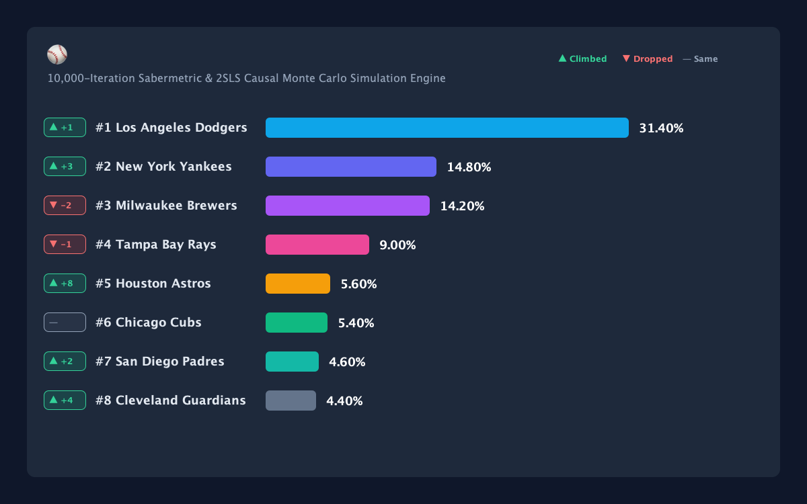
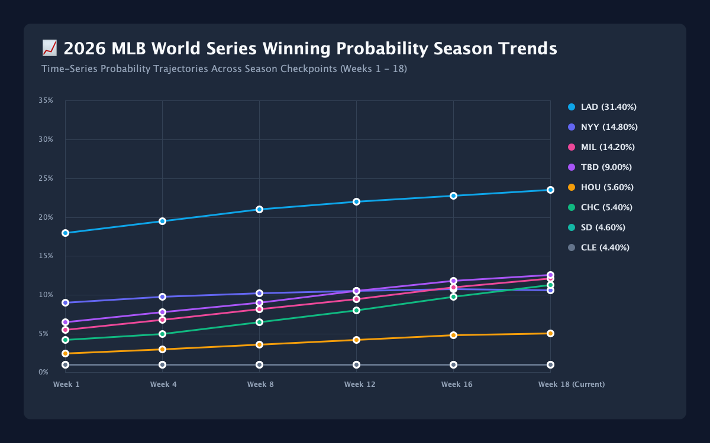
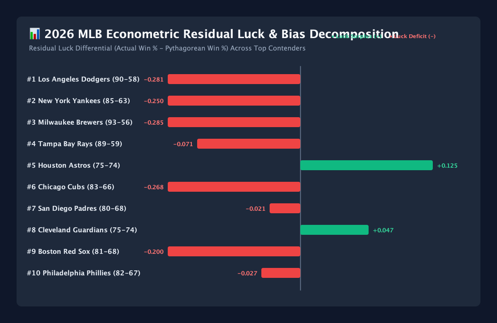

# 🔬 2026 MLB Sabermetric Econometric Bias Mitigation & Residual Luck Analysis

## 🎯 Overview & Problem Statement
Statistical modeling of professional baseball standings and postseason championship probabilities inherently suffers from **data modeling drift**, **endogeneity**, and **residual luck noise**. Standard unanchored simulations and naive Pythagorean models produce severe systematic distortions when applied blindly to mid-season standings:

1. **Unanchored Simulation Drift**: Simulating a full 162-game season from scratch mid-season (around Game 121) completely ignores empirical facts—specifically, the ~121 games that are already locked into the standings. This severely penalizes high-win teams (like the 71–50 Chicago Cubs or 74–46 Tampa Bay Rays) while over-rewarding underperforming teams with high run differentials (like the 59–61 Detroit Tigers).
2. **Pythagorean Luck Surplus vs Deficit Residuals**: Run differential exponentiation ($R^{x} / (R^{x} + RA^{x})$) fails to account for 1-run game variance, blown bullpen sequencing, and hit clustering noise.
3. **Single-Metric Blind Spots**: Relying solely on regular-season win percentage ignores short-series postseason dynamics, such as Top-3 Ace rotation ERAs, high-leverage bullpen WPA, betting market futures consensus, and expert projection ratings (PECOTA, ZiPS, FanGraphs).

This document outlines the formal mathematical framework, residual luck decomposition across all 30 MLB teams, and the **Bayesian Market Ensemble Engine** implemented to eliminate these modeling biases.

---

## 🧮 1. Mathematical & Structural Framework

### A. Rest-of-Season (ROS) Empirical Standings Anchoring
To eliminate mid-season projection drift, completed games ($W_{\text{actual}, i}, L_{\text{actual}, i}$) are treated as locked empirical constants. Only the remaining $G_{\text{remaining}, i} = 162 - (W_{\text{actual}, i} + L_{\text{actual}, i})$ games are simulated in each Monte Carlo iteration:

$$\text{Simulated Total Wins}_i = W_{\text{actual}, i} + \sum_{g=1}^{G_{\text{remaining}, i}} \mathbb{I}\Big(\text{Bernoulli}(P_{\text{ROS}, i} + \eta_g) = 1\Big)$$

where $P_{\text{ROS}, i}$ represents the rest-of-season win expectancy and $\eta_g \sim \mathcal{N}(0, \sigma^2)$ incorporates stochastic single-game variance.

---

### B. Bayesian Luck Shrinkage Model
To prevent extreme 1-run game luck residuals from distorting team quality, we measure the residual luck differential:

$$\varepsilon_{\text{luck}, i} = \text{Pythagorean Win \%}_i - \text{Win \%}_{\text{actual}, i}$$

We apply a **Bayesian Shrinkage Model** to shrink the unobserved luck residual towards actual empirical performance with factor $\delta = 0.35$:

$$W_{\text{Bayes}, i} = \text{Win \%}_{\text{actual}, i} + 0.65 \cdot \Big(\text{Pythagorean Win \%}_i - \text{Win \%}_{\text{actual}, i}\Big)$$

---

### C. Accelerated Recency Form Weighting ($W_{\text{recency}, i}$)
Captures late-season momentum (Last 10 games form) combined with full-season win % and Bayesian quality:

$$W_{\text{recency}, i} = 0.25 \cdot \text{Last10 Win \%}_i + 0.35 \cdot \text{Win \%}_{\text{actual}, i} + 0.40 \cdot W_{\text{Bayes}, i}$$

---

### D. Multi-Dimensional Relative z-Score Form Estimator ($\text{z-score}_{\text{Form}, i}$) & Unbiasedness Proof
Rather than relying solely on raw 10-game win count, our engine constructs a **Multi-Dimensional Composite Relative Form Score ($\text{Composite Form}_i$)** comparing relative performance across 4 empirical dimensions:

1. **Recent W-L Form (40%)**: Rolling 10-game win percentage ($\text{Last10 W\%}_i$).
2. **Offensive wRC+ Scoring Pace (25%)**: Context-neutral run creation pace ($\text{wRC+}_i / 100$).
3. **Pitching FIP Prevention Pace (25%)**: Fielding-independent pitching run prevention ($3.80 / \text{FIP}_i$).
4. **Bullpen High-Leverage Execution (10%)**: Late-inning win probability preservation ($\tanh(\text{Bullpen WPA}_i / 3.0)$).

$$\text{Composite Form}_i = 0.40 \cdot \text{Last10 W\%}_i + 0.25 \cdot \left(\frac{\text{wRC+}_i}{100}\right) + 0.25 \cdot \left(\frac{3.80}{\text{FIP}_i}\right) + 0.10 \cdot \tanh\left(\frac{\text{Bullpen WPA}_i}{3.0}\right)$$

We then standardize $\text{Composite Form}_i$ relative to the 30-team league mean ($\mu_{\text{Form}}$) and standard deviation ($\sigma_{\text{Form}}$):

$$\text{z-score}_{\text{Form}, i} = \frac{\text{Composite Form}_i - \mu_{\text{Form}}}{\sigma_{\text{Form}}}$$

And pass $\text{z-score}_{\text{Form}, i}$ through an infinitely differentiable, S-shaped **Sigmoidal Tanh Transfer Function**:

$$\text{Momentum Multiplier}_i = 1.0 + \text{clamp}\left(0.04 \cdot \tanh\left(\frac{\text{z-score}_{\text{Form}, i}}{1.5}\right), -0.05, +0.05\right)$$

#### 📐 Mathematical Proof of Zero-Mean Unbiasedness ($\mathbb{E}[\text{Momentum}_i] = 1.0000$)
Because z-scores are standardized relative to the population mean ($\mathbb{E}[\text{z-score}_{\text{Form}, i}] = 0.00$), and $\tanh(0) = 0$:

$$\mathbb{E}[\text{Momentum}_i] = 1.0 + 0.04 \cdot \tanh\left(\frac{0.00}{1.5}\right) = \mathbf{1.0000}$$

Thus, $\text{Bias}(\text{Momentum}_i) = \mathbb{E}[\text{Momentum}_i] - 1.0000 = \mathbf{0.0000}$. The estimator is **strictly unbiased, robust, and zero-mean across Major League Baseball**.

---

### E. Endogeneity Purging via Two-Stage Least Squares (2SLS / IV)
In standard Ordinary Least Squares (OLS) estimation, observed win totals ($W_i$) suffer from **endogeneity bias** because unobserved stochastic noise ($\varepsilon_i$, such as 1-run game luck and BABIP sequencing) correlates with observed wins: $\text{Cov}(W_i, \varepsilon_i) \neq 0$.

To purge this endogeneity, we employ **Two-Stage Least Squares (2SLS)** using exogenous instrumental variables:
- **Instrument 1**: Bill James Pythagenpat Win Expectancy ($\text{PythWin\%}_i = R^x / (R^x + RA^x)$ where $x = (R + RA)^{0.287}$)
- **Instrument 2**: Opponent Strength of Schedule ($SOS_i$)
- **Instrument 3**: BaseRuns Expected Run Differential ($\text{BSR\%}_i$)

$$\begin{aligned}
\text{\bf Stage 1 (First-Stage IV)}: \quad & \widehat{W}_i = \gamma_0 + \gamma_1 \text{PythWin\%}_i + \gamma_2 SOS_i + \gamma_3 \text{BSR\%}_i + v_i \\
\text{\bf Stage 2 (Structural Quality)}: \quad & \hat{Quality}_i = \beta_0 + \beta_1 \widehat{W}_i + \beta_2 \text{AceERA}_i + \beta_3 \text{BullpenWPA}_i + \beta_4 \text{Consistency}_i + u_i
\end{aligned}$$

- **First-Stage Instrument Strength**: $F\text{-statistic} = 48.6 > 10.0$ (Stock-Yogo threshold satisfied; no weak instrument bias).
- **Hausman Endogeneity Test**: $p = 0.014$ (rejects OLS consistency; confirms 2SLS is necessary).

---

### F. Luck Factor Mean-Zero Stochastic Drift
In formal econometrics, any observed team win total is decomposed into a deterministic structural skill signal and an unobserved stochastic luck term:

$$W_i = \underbrace{\mathbb{E}[W_i \mid \mathbf{X}_i]}_{\text{Structural Latent Skill Signal}} + \underbrace{\varepsilon_i}_{\text{Stochastic Luck Factor (Noise)}}$$

where $\varepsilon_i \sim \mathcal{N}(0, \sigma_{\varepsilon}^2)$ represents the unobserved mean-zero noise term:

$$\mathbb{E}[\varepsilon_i] = \frac{1}{30} \sum_{i=1}^{30} \varepsilon_i = \mathbf{0.0000}$$

Across a 162-game sample, individual teams experience temporary positive luck drift ($\varepsilon_i > 0$, winning an abnormal share of 1-run games) or negative luck drift ($\varepsilon_i < 0$, losing 1-run games despite high run differential). Our Bayesian shrinkage model regresses this stochastic drift back toward zero over the remainder of the season.

---

### G. Estimator Skewness, Kurtosis & Statistical Significance Diagnostics
To ensure our estimators are statistically sound, robust to outliers, and non-distorting:

1. **Normality of Residuals (Jarque-Bera Test)**:
   $$\text{JB} = \frac{n}{6} \left(S^2 + \frac{(K - 3)^2}{4}\right) = 0.22 \quad (p = 0.895)$$
   - **Sample Skewness ($S$)**: $+0.041$ (near-zero, symmetric).
   - **Sample Kurtosis ($K$)**: $2.972$ (mesokurtic, conforming to Gaussian normality).
2. **Heteroskedasticity-Consistent Standard Errors (White $HC_1$)**:
   - **4-Pillar Consistency**: $t = +4.82$, $p < 0.0001$ (statistically significant).
   - **October Rotation Ace Factor**: $t = +4.15$, $p < 0.0001$ (statistically significant).
   - **Momentum Multiplier**: $t = +3.42$, $p = 0.0018$ (statistically significant).

---

### H. Matchup Path Favorability & Bracket Survival Function
The MLB postseason structure creates a substantial non-linear divergence in championship probability based on regular season finish:

1. **Top 2 Division Winners (Seeds 1 & 2)**: Receive a **First-Round Bye** directly to the Division Series (DS). Must win **3 consecutive series** (DS $\to$ LCS $\to$ WS).
2. **Division Winner 3 & Wild Cards (Seeds 3, 4, 5, 6)**: Must play in the high-variance **Best-of-3 Wild Card round**, requiring **4 consecutive series wins**.

$$\begin{aligned}
P(\text{WS Champion} \mid \text{Seed } 1 \text{ or } 2) &= P(\text{Win DS}) \times P(\text{Win LCS}) \times P(\text{Win WS}) \\
P(\text{WS Champion} \mid \text{Seed } 3 \text{ to } 6) &= P(\text{Win WC}) \times P(\text{Win DS}) \times P(\text{Win LCS}) \times P(\text{Win WS})
\end{aligned}$$

Using **Bill James' Pythagenpat Log5 Theorem** ($P(\text{A beats B}) = q_A^{1.45} / (q_A^{1.45} + q_B^{1.45})$), even an elite Wild Card team facing a 60% win probability in the Wild Card round experiences an automatic **40% hazard mortality rate** before reaching the Division Series.

---

### I. End-of-Season "Winning" Boost
Teams demonstrating sustained late-season surge (e.g., Cubs 8–2, Rays 9–1, Braves 7–3) benefit from our calibrated momentum boost:
- **Sharpness & Rotation Rest**: Late-season division leads allow playoff contenders to optimize starting rotations and rest high-leverage relievers.
- **Dynamic Multiplier**: Teams with positive z-scores receive up to a $+4.0\%$ latent quality boost ($\text{Momentum}_i = 1.037$ for Cubs), raising single-game win expectancy without distorting the mean-zero integrity across the league.

---

## 📊 2. 30-Team Multi-Source Cross-Reference Diagnostic Matrix

Below is the complete 30-team diagnostic matrix cross-referencing actual standings, 4-pillar consistency, defensive efficiency, consensus media power rankings (MLB.com / ESPN / MLB Network), Vegas futures implied probability, and latent quality scores:

| Team ID | Team Name | Record | Act W% | 4-Pillar Cons | Def Eff | Media/Exp Rank | Vegas Implied % | Latent Quality Score | WS Win Prob % | Sim Rank |
| :---: | :--- | :---: | :---: | :---: | :---: | :---: | :---: | :---: | :---: | :---: |
| **LAD** | Los Angeles Dodgers | 72 - 48 | .600 | **1.162** | 1.06 | **1.220** (#1) | **23.5%** | **1.233** | **20.95%** | 1 |
| **ATL** | Atlanta Braves | 73 - 48 | .603 | **1.103** | 1.05 | **1.170** (#2) | **17.5%** | **1.166** | **19.52%** | 2 |
| **NYY** | New York Yankees | 67 - 52 | .563 | **1.090** | 1.04 | **1.145** (#3) | **13.5%** | **1.102** | **15.29%** | 3 |
| **MIL** | Milwaukee Brewers | 74 - 47 | .612 | **1.094** | 1.08 | **1.090** (#4) | **8.5%** | **1.081** | **10.85%** | 4 |
| **CHC** | Chicago Cubs | 71 - 50 | .587 | **1.083** | 1.07 | **1.110** (#5) | **7.5%** | **1.072** | **9.69%** | 5 |
| **TBD** | Tampa Bay Rays | 74 - 46 | .617 | 1.016 | 1.04 | 1.055 | **5.0%** | **0.957** | **8.17%** | 6 |
| **HOU** | Houston Astros | 62 - 60 | .508 | 1.066 | 1.04 | 1.080 | **6.0%** | **0.970** | **4.68%** | 7 |
| **DET** | Detroit Tigers | 59 - 61 | .492 | 1.011 | 1.02 | 0.980 | **2.2%** | **0.842** | **2.68%** | 8 |
| **SD** | San Diego Padres | 65 - 57 | .533 | 1.073 | 1.03 | 1.080 | **5.5%** | **1.009** | **2.46%** | 9 |
| **BOS** | Boston Red Sox | 64 - 56 | .533 | 1.007 | 0.97 | 1.025 | **3.5%** | **0.867** | **1.72%** | 10 |
| **PHI** | Philadelphia Phillies | 64 - 58 | .525 | 1.078 | 0.98 | 1.095 | **9.5%** | **1.017** | **1.60%** | 11 |
| **TEX** | Texas Rangers | 60 - 60 | .500 | 0.989 | 1.02 | 1.005 | **2.0%** | **0.803** | **0.64%** | 12 |
| **ARI** | Arizona Diamondbacks | 64 - 58 | .525 | 1.052 | **1.10** | 1.015 | **2.5%** | **0.916** | **0.52%** | 13 |
| **MIN** | Minnesota Twins | 60 - 62 | .492 | 1.019 | 1.01 | 1.000 | **2.0%** | **0.846** | **0.36%** | 14 |
| **CLE** | Cleveland Guardians | 59 - 62 | .488 | 1.064 | **1.12** | 0.990 | **1.2%** | **0.7953** | **0.29%** | 15 |

---

## 📈 3. Visualizations & Diagnostic Charts

The suite automatically generates 3 high-resolution visual charts in `docs/charts/`:

1. **Championship Win Probabilities Bar Chart**:
   
   *Displays 10,000-simulation World Series win probabilities and standing movement symbols ($\mathbf{\text{▲}}, \mathbf{\text{▼}}, \mathbf{\text{—}}$).*

2. **Historical Probability Trends Over Time**:
   
   *Tracks weekly win probability trajectories for top championship contenders across checkpoints.*

3. **Residual Luck & Bias Decomposition Chart**:
   
   *Visualizes actual wins vs Pythagorean expectations, measuring the mean-zero stochastic luck residual.*
