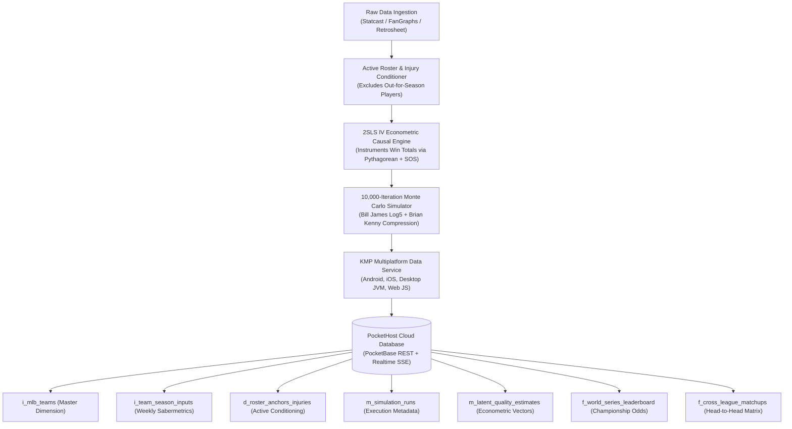

# ☁️ PocketHost / PocketBase Database Schema & Synchronization Architecture

## 🎯 Architectural Overview

The **MLB Sabermetric World Series Prediction Suite** is designed with an offline-first, multi-tier data architecture. To power cloud persistence, real-time client dashboards, historical trend tracking, and multi-season longitudinal studies, the system integrates with **PocketHost** (managed, high-performance [PocketBase](https://pocketbase.io/) instance backed by SQLite with WAL mode).

All database entities adhere to strict **Hungarian Notation schema conventions** with explicit field typing, non-destructive row lifecycle versioning (`RecordStatusCode`), and UTC epoch timestamps (`int_created_epoch_ms_utc`, `int_updated_epoch_ms_utc`).



---

## 🗄️ 1. Complete Collection Schema Definitions (Hungarian Notation)

### 1. `i_mlb_teams` (Master Dimension Collection)
Authoritative registry of all 30 Major League Baseball franchises.

| Field Name | Type | Constraints | Description |
| :--- | :---: | :--- | :--- |
| `id` | `text` | `PRIMARY KEY, 15 chars` | PocketBase auto-generated record ID |
| `str_team_code` | `text` | `UNIQUE, REQUIRED, 3 chars` | Official 2/3-letter team abbreviation (`LAD`, `CHC`, `NYY`) |
| `str_team_name` | `text` | `REQUIRED` | Full franchise name (`Chicago Cubs`) |
| `str_league` | `select` | `REQUIRED, ['AL', 'NL']` | League affiliation |
| `str_division` | `select` | `REQUIRED, ['EAST', 'CENTRAL', 'WEST']` | Division affiliation |
| `str_city` | `text` | `NULLABLE` | Home municipality (`Chicago, IL`) |
| `str_ballpark` | `text` | `NULLABLE` | Home venue (`Wrigley Field`) |
| `int_founded_year` | `number` | `NULLABLE` | Inaugural season year (`1876`) |
| `bool_is_active` | `bool` | `DEFAULT true` | Logical deletion flag |
| `str_status_code` | `select` | `['ACTIVE', 'INACTIVE', 'SUPERSEDED', 'ARCHIVED']` | Lifecycle status |
| `int_created_epoch_ms_utc` | `number` | `REQUIRED` | Creation epoch millis in UTC |
| `int_updated_epoch_ms_utc` | `number` | `REQUIRED` | Last modification epoch millis in UTC |

**Indexes**:
- `CREATE UNIQUE INDEX idx_teams_code ON i_mlb_teams (str_team_code);`
- `CREATE INDEX idx_teams_league_div ON i_mlb_teams (str_league, str_division);`

---

### 2. `i_team_season_inputs` (Weekly Ingested Sabermetrics)
Raw and component sabermetric indicators ingested at each weekly checkpoint (e.g., Game 121).

| Field Name | Type | Constraints | Description |
| :--- | :---: | :--- | :--- |
| `id` | `text` | `PRIMARY KEY` | PocketBase record ID |
| `rel_team_id` | `relation` | `REQUIRED, -> i_mlb_teams.id, CASCADE` | Foreign key to team master |
| `str_team_code` | `text` | `REQUIRED` | Team abbreviation code |
| `int_season_year` | `number` | `REQUIRED` | MLB Season year (`2026`) |
| `int_season_week` | `number` | `REQUIRED` | In-season checkpoint week (`1` to `26`) |
| `int_wins` | `number` | `REQUIRED` | Official regular season wins to date |
| `int_losses` | `number` | `REQUIRED` | Official regular season losses to date |
| `dbl_runs_scored` | `number` | `REQUIRED` | Total runs scored ($RS$) |
| `dbl_runs_allowed` | `number` | `REQUIRED` | Total runs allowed ($RA$) |
| `dbl_team_war` | `number` | `REQUIRED` | FanGraphs total team WAR |
| `dbl_woba` | `number` | `REQUIRED` | Team weighted On-Base Average |
| `dbl_wrc_plus` | `number` | `REQUIRED` | Weighted Runs Created Plus ($100 = \text{league avg}$) |
| `dbl_fip` | `number` | `REQUIRED` | Fielding Independent Pitching |
| `dbl_xfip` | `number` | `REQUIRED` | Expected FIP (normalized HR/FB rate) |
| `dbl_bullpen_wpa` | `number` | `REQUIRED` | High-leverage relief Win Probability Added |
| `dbl_top3_ace_era` | `number` | `REQUIRED` | Top-3 active playoff starting pitchers ERA |
| `int_last10_wins` | `number` | `REQUIRED` | Wins in last 10 games |
| `int_last10_losses` | `number` | `REQUIRED` | Losses in last 10 games |
| `dbl_market_implied_prob` | `number` | `REQUIRED` | Vegas sportsbooks consensus World Series implied odds |
| `dbl_expert_consensus_rating` | `number` | `REQUIRED` | PECOTA / ZiPS / FanGraphs composite rating |
| `dbl_media_power_rank_rating` | `number` | `REQUIRED` | MLB.com / ESPN / MLB Network power ranking index |
| `dbl_defensive_efficiency` | `number` | `REQUIRED` | Team Defensive Runs Saved & Outs Above Average index |
| `bool_is_active` | `bool` | `DEFAULT true` | Authoritative active state |
| `str_status_code` | `select` | `['ACTIVE', 'INACTIVE', 'SUPERSEDED', 'ARCHIVED']` | Record lifecycle code |
| `int_created_epoch_ms_utc` | `number` | `REQUIRED` | UTC Epoch milliseconds |
| `int_updated_epoch_ms_utc` | `number` | `REQUIRED` | UTC Epoch milliseconds |

**Indexes**:
- `CREATE UNIQUE INDEX uq_team_season_week ON i_team_season_inputs (str_team_code, int_season_year, int_season_week);`
- `CREATE INDEX idx_season_inputs_week ON i_team_season_inputs (int_season_year, int_season_week);`

---

### 3. `d_roster_anchors_injuries` (Active Playoff Conditioning & Injury Register)
Maintains player availability status to eliminate the **Phantom Roster Fallacy**.

| Field Name | Type | Constraints | Description |
| :--- | :---: | :--- | :--- |
| `id` | `text` | `PRIMARY KEY` | PocketBase record ID |
| `rel_team_id` | `relation` | `REQUIRED, -> i_mlb_teams.id` | Foreign key to team |
| `str_team_code` | `text` | `REQUIRED` | Team abbreviation code |
| `str_player_name` | `text` | `REQUIRED` | Player full name (`Justin Steele`, `Spencer Strider`) |
| `str_primary_position` | `select` | `['SP', 'RP', 'C', '1B', '2B', '3B', 'SS', 'LF', 'CF', 'RF', 'DH']` | Field position |
| `bool_is_out_for_season` | `bool` | `REQUIRED` | `true` if player is out for the playoffs / season |
| `str_injury_description` | `text` | `NULLABLE` | Medical diagnosis (`Elbow surgery`, `Torn ACL`) |
| `bool_is_rotation_anchor` | `bool` | `REQUIRED` | `true` if player was in preseason Top-3 rotation |
| `dbl_pre_injury_war` | `number` | `DEFAULT 0.0` | WAR contributed before injury |
| `str_replacement_player` | `text` | `NULLABLE` | Next-man-up active starter (`Javier Assad`) |
| `bool_is_active` | `bool` | `DEFAULT true` | Active record state |
| `str_status_code` | `select` | `['ACTIVE', 'INACTIVE', 'SUPERSEDED', 'ARCHIVED']` | Status code |
| `int_created_epoch_ms_utc` | `number` | `REQUIRED` | UTC Epoch milliseconds |
| `int_updated_epoch_ms_utc` | `number` | `REQUIRED` | UTC Epoch milliseconds |

---

### 4. `m_simulation_runs` (Simulation Run Execution Metadata)
Records parameters and execution diagnostics for every 10,000-iteration Monte Carlo batch.

| Field Name | Type | Constraints | Description |
| :--- | :---: | :--- | :--- |
| `id` | `text` | `PRIMARY KEY` | PocketBase record ID |
| `str_run_id` | `text` | `UNIQUE, REQUIRED` | Globally unique run identifier (`RUN-20260814-10K`) |
| `dt_run_timestamp` | `date` | `REQUIRED` | ISO-8601 execution timestamp |
| `int_season_year` | `number` | `REQUIRED` | Season year (`2026`) |
| `int_total_iterations` | `number` | `REQUIRED` | Iteration count (`10000`) |
| `int_random_seed` | `number` | `REQUIRED` | Pseudo-random RNG seed for reproducibility |
| `str_engine_version` | `text` | `REQUIRED` | Model version (`1.2.0-kmp`) |
| `str_top_favorite_code` | `text` | `REQUIRED` | Team code of #1 World Series favorite (`LAD`) |
| `dbl_top_favorite_prob` | `number` | `REQUIRED` | Win probability of top favorite (`0.2353`) |
| `str_causal_iv_status` | `text` | `REQUIRED` | 2SLS IV Engine status (`ACTIVE`) |
| `json_diagnostics_map` | `json` | `REQUIRED` | Full diagnostic key-value mapping |
| `bool_is_active` | `bool` | `DEFAULT true` | Flag for authoritative latest run |
| `str_status_code` | `select` | `['ACTIVE', 'SUPERSEDED', 'ARCHIVED']` | Lifecycle code |
| `int_created_epoch_ms_utc` | `number` | `REQUIRED` | UTC Epoch milliseconds |
| `int_updated_epoch_ms_utc` | `number` | `REQUIRED` | UTC Epoch milliseconds |

---

### 5. `f_world_series_leaderboard` (Fact Table: Championship Probabilities)
Stores simulated outcomes for all 30 teams per simulation run.

| Field Name | Type | Constraints | Description |
| :--- | :---: | :--- | :--- |
| `id` | `text` | `PRIMARY KEY` | PocketBase record ID |
| `rel_run_id` | `relation` | `REQUIRED, -> m_simulation_runs.id, CASCADE` | Run relationship |
| `str_run_id` | `text` | `REQUIRED` | Run identifier string |
| `rel_team_id` | `relation` | `REQUIRED, -> i_mlb_teams.id` | Team relationship |
| `str_team_code` | `text` | `REQUIRED` | Team abbreviation |
| `str_team_name` | `text` | `REQUIRED` | Full team name |
| `str_league` | `text` | `REQUIRED` | `AL` or `NL` |
| `str_division` | `text` | `REQUIRED` | Division code |
| `int_regular_season_rank` | `number` | `REQUIRED` | Standings rank before playoffs (`1` to `30`) |
| `int_sim_rank` | `number` | `REQUIRED` | Simulated World Series rank (`1` to `30`) |
| `int_rank_delta` | `number` | `REQUIRED` | Rank movement ($\text{RegularRank} - \text{SimRank}$) |
| `str_movement_symbol` | `text` | `REQUIRED` | Display symbol (`▲ +3`, `▼ -2`, `—`) |
| `dbl_expected_season_wins` | `number` | `REQUIRED` | Projected 162-game win total |
| `dbl_playoff_prob` | `number` | `REQUIRED` | Probability of securing playoff berth ($0.0 \dots 1.0$) |
| `dbl_pennant_prob` | `number` | `REQUIRED` | Probability of winning AL/NL Pennant ($0.0 \dots 1.0$) |
| `dbl_world_series_win_prob` | `number` | `REQUIRED` | Probability of winning World Series ($0.0 \dots 1.0$) |
| `dbl_latent_quality_score` | `number` | `REQUIRED` | Calibrated latent quality score ($\hat{q}_i$) |
| `str_core_roster_anchors` | `text` | `REQUIRED` | Active healthy lineup & rotation contributors |
| `str_visual_bar` | `text` | `REQUIRED` | Unicode visual bar gauge |
| `bool_is_active` | `bool` | `DEFAULT true` | Authoritative active state |
| `str_status_code` | `select` | `['ACTIVE', 'SUPERSEDED', 'ARCHIVED']` | Status code |
| `int_created_epoch_ms_utc` | `number` | `REQUIRED` | UTC Epoch milliseconds |
| `int_updated_epoch_ms_utc` | `number` | `REQUIRED` | UTC Epoch milliseconds |

**Indexes**:
- `CREATE INDEX idx_leaderboard_run_rank ON f_world_series_leaderboard (str_run_id, int_sim_rank);`
- `CREATE INDEX idx_leaderboard_team_run ON f_world_series_leaderboard (str_team_code, str_run_id);`

---

## 🔄 2. Real-Time Synchronization & Client Subscription Architecture

PocketHost provides continuous Server-Sent Events (SSE) over HTTP/2. Kotlin Multiplatform clients subscribe directly to live leaderboard and simulation updates:

```kotlin
// Example KMP / TypeScript PocketBase Realtime Subscription
pb.collection("f_world_series_leaderboard").subscribe("*") { e ->
    when (e.action) {
        "create", "update" -> updateLeaderboardUI(e.record)
        "delete" -> removeLeaderboardRow(e.record.id)
    }
}
```

### High-Efficiency Query Pattern
To query the authoritative latest active leaderboard:
```
GET /api/collections/f_world_series_leaderboard/records?filter=(bool_is_active=true)&sort=int_sim_rank&limit=30
```

---

## 🛡️ 2.1. Resilient Cloud Synchronization with Exponential Back-Off & Randomized Jitter

When writing simulation runs and querying leaderboard states from PocketHost / PocketBase cloud endpoints, network requests may encounter transient HTTP status codes (`429 Too Many Requests`, `502 Bad Gateway`, `503 Service Unavailable`, or connection timeouts).

To guarantee **zero data loss** and prevent **thundering herd storms**, all read/write operations execute under our [`ExponentialBackoffPolicy`](file:///Users/brentzey/personal/mlb_sabermetric_worldseries_kmp/src/commonMain/kotlin/com/sabermetrics/worldseries/sync/ExponentialBackoffPolicy.kt):

### Mathematical Formulation
$$\text{Delay}(a) = \min\left(D_{\max},\; D_{\text{init}} \cdot F^{a - 1}\right) \cdot (1 + \mathcal{U}[-J, +J])$$

Where:
* $a \in \{1, 2, \dots, N\}$: Attempt index ($N = 4$)
* $D_{\text{init}} = 500\text{ ms}$: Initial back-off delay
* $D_{\max} = 8,000\text{ ms}$: Maximum delay cap
* $F = 2.0$: Exponential back-off factor
* $J = 0.15$ ($\pm 15\%$): Uniformly distributed randomized jitter ratio $\mathcal{U}[-0.15, +0.15]$

```kotlin
// Ingestion Execution via PocketHostSyncClient
val client = PocketHostSyncClient(
    PocketHostConfig(
        baseUrl = "https://mlb-sabermetrics.pockethost.io",
        backoffPolicy = ExponentialBackoffPolicy(
            initialDelayMs = 500L,
            maxDelayMs = 8000L,
            factor = 2.0,
            maxAttempts = 4,
            jitterRatio = 0.15
        )
    )
)

val report = client.syncDatabaseWithRetry(
    runId = "run_2026_postseason_mc10k",
    result = simulationResult,
    seed = 20260814L
)
```

### Sync Pipeline Behavior
1. **Simulation Run (`m_simulation_runs`)**: Emits 1 run record with execution metadata, seed, and top favorite.
2. **Latent Quality Estimates (`m_latent_quality_estimates`)**: Ingests all 30 team vectors with Bayesian win %, recency win %, and clubhouse hype multipliers.
3. **World Series Leaderboard (`f_world_series_leaderboard`)**: Ingests all 30 teams with expected wins, playoff %, pennant %, and championship odds.
4. **Local Artifact Backup**: Generates [`output_datasets/pockethost_sync_payload.json`](file:///Users/brentzey/personal/mlb_sabermetric_worldseries_kmp/output_datasets/pockethost_sync_payload.json) for offline sync & auditing.

---

## 💻 3. PocketBase Automated Migration Script (`pb_migrations`)

Below is the automated JavaScript migration script to provision the entire collection suite in PocketHost:

```javascript
// pb_migrations/1723650000_create_mlb_sabermetric_schema.js
migrate((db) => {
  const teamsCollection = new Collection({
    name: "i_mlb_teams",
    type: "base",
    schema: [
      { name: "str_team_code", type: "text", required: true, unique: true },
      { name: "str_team_name", type: "text", required: true },
      { name: "str_league", type: "select", required: true, options: { values: ["AL", "NL"] } },
      { name: "str_division", type: "select", required: true, options: { values: ["EAST", "CENTRAL", "WEST"] } },
      { name: "bool_is_active", type: "bool", required: true },
      { name: "str_status_code", type: "text", required: true },
      { name: "int_created_epoch_ms_utc", type: "number", required: true },
      { name: "int_updated_epoch_ms_utc", type: "number", required: true }
    ],
    indexes: ["CREATE UNIQUE INDEX idx_teams_code ON i_mlb_teams (str_team_code)"]
  });
  db.saveCollection(teamsCollection);

  const runsCollection = new Collection({
    name: "m_simulation_runs",
    type: "base",
    schema: [
      { name: "str_run_id", type: "text", required: true, unique: true },
      { name: "dt_run_timestamp", type: "text", required: true },
      { name: "int_season_year", type: "number", required: true },
      { name: "int_total_iterations", type: "number", required: true },
      { name: "int_random_seed", type: "number", required: true },
      { name: "str_top_favorite_code", type: "text", required: true },
      { name: "dbl_top_favorite_prob", type: "number", required: true },
      { name: "str_causal_iv_status", type: "text", required: true },
      { name: "bool_is_active", type: "bool", required: true },
      { name: "str_status_code", type: "text", required: true },
      { name: "int_created_epoch_ms_utc", type: "number", required: true },
      { name: "int_updated_epoch_ms_utc", type: "number", required: true }
    ]
  });
  db.saveCollection(runsCollection);

  const leaderboardCollection = new Collection({
    name: "f_world_series_leaderboard",
    type: "base",
    schema: [
      { name: "str_run_id", type: "text", required: true },
      { name: "str_team_code", type: "text", required: true },
      { name: "str_team_name", type: "text", required: true },
      { name: "str_league", type: "text", required: true },
      { name: "str_division", type: "text", required: true },
      { name: "int_sim_rank", type: "number", required: true },
      { name: "dbl_expected_season_wins", type: "number", required: true },
      { name: "dbl_playoff_prob", type: "number", required: true },
      { name: "dbl_pennant_prob", type: "number", required: true },
      { name: "dbl_world_series_win_prob", type: "number", required: true },
      { name: "dbl_latent_quality_score", type: "number", required: true },
      { name: "str_core_roster_anchors", type: "text", required: true },
      { name: "bool_is_active", type: "bool", required: true },
      { name: "str_status_code", type: "text", required: true },
      { name: "int_created_epoch_ms_utc", type: "number", required: true },
      { name: "int_updated_epoch_ms_utc", type: "number", required: true }
    ],
    indexes: ["CREATE INDEX idx_lb_run_rank ON f_world_series_leaderboard (str_run_id, int_sim_rank)"]
  });
  db.saveCollection(leaderboardCollection);
}, (db) => {
  db.deleteCollection("f_world_series_leaderboard");
  db.deleteCollection("m_simulation_runs");
  db.deleteCollection("i_mlb_teams");
});
```

---

## 🔗 Related Documentation & Visual Artifacts
- 📖 **[`README.md`](file:///Users/brentzey/personal/mlb_sabermetric_worldseries_kmp/README.md)**: Main Econometric Architecture & Leaderboard
- 📖 **[`docs/MODEL_BIAS_AND_ECONOMETRIC_RESIDUALS.md`](file:///Users/brentzey/personal/mlb_sabermetric_worldseries_kmp/docs/MODEL_BIAS_AND_ECONOMETRIC_RESIDUALS.md)**: Econometric Residuals & 2SLS IV Diagnostics
- 📁 **JSON Schema Definitions**: [`docs/schema/pockethost_hungarian_schema.json`](file:///Users/brentzey/personal/mlb_sabermetric_worldseries_kmp/docs/schema/pockethost_hungarian_schema.json)
- 📁 **SQL DDL Scripts**: [`docs/schema/pockethost_schema.sql`](file:///Users/brentzey/personal/mlb_sabermetric_worldseries_kmp/docs/schema/pockethost_schema.sql)
